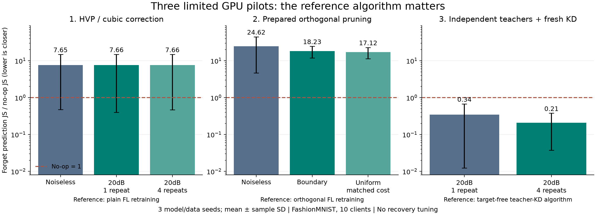

**세 방법을 실제로 실행한 결과 — 2026-09-26**

**후속 정정:** 아래①은 원래 V1의 삭제신호 합산을 재현한 실험이 아니라 CNN CuReNUS 변형이다. 따라서 이 실패로 V1 또는 성공했던 convex-head 방법을 기각하지 않는다. 사용자 지적 후 공통 곡률 보정을 송신 전에 적용하는 작은 개선과②의 점수 혼동을 따로 진단했다. [의도 복원·개선안과 추가 결과](../research_20260926_methods12_revision/REVIEW_AND_IMPROVEMENTS_KO.md)를 함께 읽어야 한다. 아래 기존 실험·수치·당시 판단은 기록으로 보존한다.

공개 코드를 확보하고 수학 검증을 먼저 수행한 뒤, RTX3080에서1→2→3 순서로3개 seed를 모두 실행했다. 별도 worker를 동시에 돌리지 않았다. 원본 V1–V21 및 후속 연구는 수정하지 않았고, 이번 code·config·checkpoint·raw JSON·실패 가능성이 드러난 결과를 보존했다.

현재 근거는 **① 계산 성립/삭제 개선 미확인, ② 이 구현에서는 실제 channel 분리·삭제 개선 미확인, ③ 독립 teacher 구조에서는 조건부 성립과 GPU 재실행 일치 확인**이다. 이 판단을 원 논문의 일반적인 성공/실패로 확대하지 않는다. 이번 실행은 제한된 dataset/model로 우리 정보 조건에 맞게 옮긴 pilot이다.

**무엇을 가져왔고 무엇을 바꿨는가**

| 방법 | 확보한 실제 source | 실행 범위 |
|---|---|---|
| ① | CuReNU/CuReNUS **공식 ICLR 부록 code** | 저자 cubic solver와 CNN을 사용하고 local HVP를 OTA 집계하는 callback을 작성 |
| ② | Orthogonal CNN **공식 GitHub** | 정규화 연산 재사용; FedOrtho의2단계 훈련·activation statistics·soft pruning은 논문 수식으로 구현 |
| ③ | FedQUIT **공식 GitHub** | TF teacher 변환·KL을 PyTorch로 이식; retained CE 혼합과 독립-teacher 변형은 별도로 표시 |

FedOrtho 공식 GitHub를 확인하지 못했으므로 공식 코드 재현이라고 하지 않는다. CuReNU는 GitHub 대신 학회가 제공하는 저자 코드를 확보했다. FedQUIT의 Linux/TF full pipeline을 설치·실행한 것도 아니다. [출처·commit·변경사항](CODE_PROVENANCE_KO.md)에 구체적으로 적었다.

**수학과 구현 연결 검사**

Local gradient/HVP 합, cubic derivative, kernel regularizer, count-weighted activation 합, FedQUIT 변환·KL gradient, 실제 MAC 송수신 식을 확인했다. 실제 CNN에서 **저자 global HVP와 local HVP 합의 상대오차2.45×10⁻⁷**이었다. Ridge 등식은 정확하지만 DNN의 한 번 보정이 SGD 재학습과 동일하다는 등식은 없다.

또한 student=old teacher에서 retain KD gradient가0이라는 반례를 확인했다. 이때 target gradient와 합쳐 보내면 target 전체 gradient가 그대로 드러날 수 있다. 실제 mixed-KD에서는 retained CE gradient를 추가했다. 이는 그 반례를 피하는 protocol 변경이지 privacy 인증이 아니다. [수학 검증과 전제](MATHEMATICS_KO.md)

**실험의 삭제 기준**

FashionMNIST private12,000개, public query2,000개, validation2,000개를 서로 분리했다.10 clients가 각각1,200개를 보유하고, 그중 절반은 IID·나머지는 선호2개 class로 배분했다. Client0 전체를 삭제하되 다른 client도 같은 class의 데이터를 가지고 있다. Public label은 KD 학습에 쓰지 않았다.

저자 ConvNet2를 kernels8/hidden32,63,562 parameters로 축소했다.150 rounds와 학습량은 별도 calibration의 validation으로만 정했다. Model/data seeds271/272/273, test10,000개는 선택에 쓰지 않았다. Source training은 무잡음 OTA 극한으로 두고 삭제 전송에20/30dB 잡음을 넣었다. 전체 noisy-training 파이프라인까지 검증한 결과는 아니다.

Primary는 삭제 데이터에서 target-free reference와의 prediction JS이며, **아무것도 하지 않은 모델의 JS를1로 정규화**했다.0이면 그 reference와 예측이 같다. Forget 정확도를0으로 만드는 것을 목표로 하지 않았다. 모델별3개 seed 평균±표본표준편차이며, channel noise4반복은 seed 안에서 먼저 평균했다.

**① HVP 합산은 맞지만, 이번 solver 설정은 삭제 reference에 가까워지지 않았다.**

| 방식 | 정규화 forget JS ↓ | Test accuracy | 삭제 통신 |
|---|---:|---:|---:|
| No-op | 1.000 | 75.53% | 0 |
| Target-free FedAvg 재학습 | 0 | 75.40% | 113.854M real uses |
| CuReNUS 무잡음 집계 | 7.654 ±7.182 | 75.10% | 53.819M |
| OTA20dB,1회 | 7.662 ±7.262 | 75.04% | 53.819M |
| OTA20dB,4회 | 7.661 ±7.193 | 75.09% | 68.836M |
| Retained-gradient SGD70 steps | 3.386 ±1.652 | 75.95% | 53.819M |

이번에는 전체 Hessian·eigenbasis를 보내지 않았다. 매 outer step gradient1회와 HVP6회, 총70개 vector 집계를 수행했다. 각 query vector와 model의32bit DL까지 세면, HVP로 d² payload를 피하더라도 통신이 싸지는 것은 아니다. 같은 성능 조건이 성립하지 않으므로53.8M<113.9M만 보고 unlearning 통신 절감 성공이라고 할 수 없다.

저자 FMNIST config의 M5, outer10, inner5, LR.01, perturbation20을 옮긴 결과이며 이 작은 CNN에 맞게 재튜닝하지 않았다. 무잡음과 noisy 결과가 비슷하고 재전송을 늘려도 개선되지 않았다. 원인이 AirComp만은 아니라는 것은 확인됐지만, HVP unlearning 전체가 불가능하다는 결론은 아니다. 출발점의 retained-gradient norm, surrogate 안정성, perturbation/모델 scale, finite-step reference가 영향을 준다. 이 중 무엇이 지배적인지는 분리 ablation 전에는 확정하지 않는다.

**② 이전 합성 mask 실험의 이점이 실제 CNN에서는 유지되지 않았다.**

| 방식 | 정규화 forget JS ↓ | Test accuracy |
|---|---:|---:|
| Orthogonal source no-op | 1.000 | 75.58% |
| Target-free ortho 재학습 | 0 | 75.53% |
| 무잡음 soft pruning | 24.625 ±19.988 | 73.12% |
| OTA20dB uniform | 17.052 ±5.926 | 74.39% |
| OTA20dB boundary 재전송 | 18.225 ±6.384 | 74.37% |
| OTA20dB total-cost-matched uniform | 17.121 ±5.817 | 74.29% |

20dB에서 mask 오선택은 uniform3.500개, boundary3.417개, total-cost-matched uniform3.333개였다. Boundary의 비용은805.57 real uses, matched uniform은786.29로 더 작았다. Boundary가 강한 비교군보다 좋아졌다는 근거가 없다. 이전 합성 통계에서의59.2% 개선을 실제 FU 개선으로 가져오면 안 된다.

학습 중 kernel Gram 오차는 줄었지만 feature의 평균 절대 상관은 세 seed 모두 오히려 조금 증가했다. 예를 들어 seed271은 Gram 오차11.697→10.845인데 feature correlation은.391→.398이다. 따라서 이번 정규화 강도·구조가 기능적 분리를 달성했다고 할 수 없다. 또한 class 반응이 큰 channel을 줄이는 것이 다른 client도 보유한 class의 **특정 client 기여만** 제거하는 것과 같지 않다. 이 둘이 지금의 구체적인 진단 대상이다.

무잡음 pruning의 score를 더 정확히 받는 것과 target-free 모델에 가까워지는 것은 별개다. 어떤 잡음 조건의 결과가 무잡음 pruning보다 우연히 reference에 가깝더라도, 그것을 더 정확한 삭제 통신이라고 해석하지 않는다. Recovery tuning은 실행하지 않았다.

**③ 기존 teacher 변형과 독립 teacher 구조의 결과가 달랐다.**

FedQUIT-logit-min+retained CE를.5/.5로 합산한 변형은 무잡음에서도 normalized JS100.13, forget accuracy35.33%였다. 실제 재학습의 forget accuracy는79.75%다. 많이 틀리게 만든 것이 올바른 clean-client 삭제가 아님을 보여준다. 원래 global teacher를 fresh student로 복사하는 대조군도 JS1.360±.567로 세 seed 공통 개선을 보이지 않았다. 원형 FedQUIT의 전체 성능에 대한 반박은 아니다.

독립 teacher 구조는 각 client를 독립500 steps 학습한 후, A를 제외한 prediction을 공통 public query에서 집계하고 student를 초기값에서600 KD steps 학습했다. 이 방식의 reference는 **동일한 독립-teacher KD 알고리즘을 A 없이 실행한 결과**다.

| 독립-teacher 방식 | 자기 알고리즘 reference 대비 정규화 JS ↓ | Test accuracy |
|---|---:|---:|
| A를 포함한 기존 ensemble student | 1.000 | 72.87% |
| A 제외, 무잡음 fresh student | 0 | 72.49% |
| A 제외, OTA20dB1회 | .344 ±.331 | 72.63% |
| A 제외, OTA20dB4회 | .208 ±.170 | 72.54% |

1회와4회 모두 세 seed에서 no-op보다 가까웠다. 그러나 비율은 seed간 편차가 크고 통신 잡음은 조건당 한 realization이므로 보편적인 개선율로 해석하지 않는다. Full reference 재실행은 seed271에서 수행했다. **잔존9개 teacher를 처음부터 다시 학습했을 때9개 모두 parameter SHA256이 같았고, fresh student의 최대 parameter 차이도0이었다.** 나머지 seed의 무잡음0은 같은 target-free objective로 정의한 reference에 대한 자기 비교이며 독립 재실행 증거와 구분한다.

이 구조의 장점은 영향 경로를 설명할 수 있다는 것이다. 반면 일반 FedAvg 재학습 정확도75.40%에 비해 independent reference는72.49%이며, 공개 query data와 student 재학습이 필요하다. 따라서 이 숫자로 “기존 FedAvg에서 exact unlearning을 달성했다”고 말하지 않는다.

**Reference 변동을 추가로 확인했다.**

Plain/ortho 각 seed마다 같은 retained data·같은 초기값에서 minibatch stream만 바꾼 두 번째 reference를 만들었다. 일부 seed에서는 no-op와 reference의 차이보다 두 재학습 모델끼리의 차이가 더 컸다. 이 조건에서는 작고 미묘한 개선을 unlearning 증거로 단정하기 어렵다.

기존 solver/model을 바꾸지 않고 두 reference에 대한 평균 거리도 확인했다. 무잡음 HVP와 무잡음 pruning은 모두 no-op보다 멀다는 방향이 유지됐다. 다만 이는 제한된 predictive metric 결과이며 삭제된 개인 정보가 그대로 남았다는 직접적인 증명은 아니다. MIA AUC는 대부분.51대이고 no-op부터 chance에 가까워, 이번 공격으로 privacy 삭제 성공을 판별할 힘이 약하다. [추가 감사의 고정 범위](REFERENCE_AUDIT_PROTOCOL_KO.md), [원결과](results/reference_audit.json)

**비용과 추가 공개 정보**

- Source 준비비용: plain FL113.857M, ortho2단계227.714M real uses.②의 삭제 통계만 수백 uses라고 보고 준비비용을 빼면 안 된다. 두 단계의 총 local SGD sample 수는 같지만 model exchange가 두 번이다.
- 독립-teacher 초기 준비: local gradient samples320,000, server student samples38,400, model 배포를 포함한 통신 약.732M. 삭제 시 fresh student samples38,400을 다시 계산한다. 초기 student 배포·계산 누락을 발견해 raw row는 보존하고 derived cost audit에 보완했다.
- 독립-teacher 삭제 통신:20dB1회 약.732M,4회 약.799M. Public images가 client에 미리 없으면 최초12,544,000bit, 약4.239M real uses를 추가한다. 같은 품질·같은 학습 규칙의 비교가 아니므로 plain FL 대비 압도적인 unlearning 절감률을 주장하지 않는다.
- 같은 public query의 삭제 전후 평균을 모두 저장하면 target teacher의 prediction을 차분으로 알아낼 수 있다. 이는 개별 **전체 gradient/update**와는 다른 partial output 공개이지만 정보가 새지 않는다는 뜻은 아니다. Query 수·norm·count·cohort membership과 전체 transcript를 고려해야 한다. 현재 DP/암호학적 보장은 없다.

Cost 단위는 이상적인 real MAC의 channel-use 환산이다. 실제 RF 시간·에너지·CFO/CSI 오류를 측정하지 않았고, simulation walltime을 무선 latency로 바꾸지 않았다. 비용 원자료는 `results/cost_audit.json`이다.

**현재 판단**

①은 HVP 전송 연산을 구현할 수 있다는 것을 확인했다. 지금은 무잡음 solver의 clean-client reference 접근부터 안정화해야 하므로 추가 전송 최적화가 우선은 아니다.②는 실제 CNN에서 사전 직교화와 mask 통신의 이점이 확인되지 않았으므로 이전 합성 결과만으로 주력으로 밀 수 없다.③의 독립-teacher 변형은 정보 경로·reference·GPU 재실행이 일치해 가장 명확한 성립 근거가 있다. 다만 학습 규칙 변경과 public-data 비용을 받아들여야 하며 AirComp 전용 신규성을 확보한 것은 아니다.

다음 범위를 하나만 고른다면③에서 **공개 query 수와 확률 전송 정밀도를 줄여도 target-free student와의 차이가 유지되는지**를 작은 예산 비교로 확인하는 것이 타당하다. 이번 turn에서는 그 새로운 sweep까지 자동으로 확대하지 않았다.1·2·3의 사전 고정 실험과 추가 reference 감사는 모두 완료했다.

