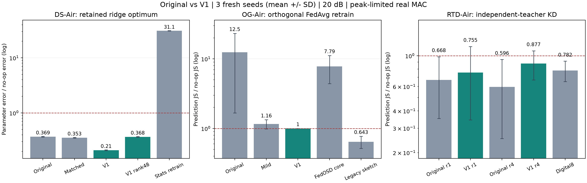

**①은 개선을 확인했고, ②와③의 V1은 채택 근거가 부족하다.**

2026-09-26. 작업명을 정하고 Original/V1을 구별한 뒤 RTX3080 한 worker에서①→②→③ 순차 실험을 완료했다. 처음에 사용한 seed를 재사용하지 않고 CNN371/372/373, ridge202609263/264/265로 평가했다.①은 seed당16개,②③은 seed당4개 channel noise다. 아래 평균은 noise를 seed 안에서 먼저 평균한 결과다. 최초③의 수치 문제를 발견해 양쪽에 같은 정밀도 수정을 적용했고 최초 결과도 보존했다.

**빠르게 비교할 주 결과**

| 작업명 | Original → V1 | Original 오차 ↓ | V1 오차 ↓ | Original → V1 총 real uses | 판단 |
|---|---|---:|---:|---:|---|
| **DS-Air**: Deletion-Signal AirComp | 서버 곡률 보정 → 송신 전 공통 곡률 보정 | .369047 | **.210444** | 143,940 → 144,643 | 성능 개선 확인; full-vector 정보 제한은 별도 문제 |
| **OG-Air**: Orthogonal-Gate AirComp | activation pruning → 작은 gate-gradient contrast 보정 | 12.466650 | .999739 | 1,375,097 → 1,375,097 | 손상은 완화했지만 no-op=1과 거의 같음 |
| **RTD-Air**: Retained-Teacher Distillation over AirComp | 확률10좌표 → 공통 성분을 제거한9좌표,1회 전송 | .668330 | .755425 | 731,755 → 729,505 | 최종 삭제오차 개선 미확인; Original 유지 |

**세 행의 오차를 서로 비교해 순위를 만들면 안 된다.**①은 고정-feature ridge의 parameter squared error이며②③은 prediction JS다.②는 orthogonal FedAvg 재학습,③은 독립 teacher KD 재학습을 reference로 쓴다. 모두 각자의 no-op를1로 정규화했지만 같은 문제는 아니다. `Original`은 우리 이전 구현이지 원 논문 전체 재현이 아니다.

①의 송신 전 보정은 original 대비43.0% 낮은 오차다. 추가 곡률 방송비만큼 Original에 재전송 예산을 더 준 비교에서는 **.353435→.210444,40.5% 감소**다. 비용은144,525와144,643으로0.082% 차이다. 이 결과는 특정 noise·모델·전력 조건의 소규모 확인이며 통계적 우월성의 일반 인증은 아니다.

**① DS-Air: 유지할 개선과 남은 조건**

공개 무작위 encoder 784→64+bias와 ridge head 65×10, λ=.01을 사용했다. Private data 10,000개를 가진 10개 client 중 client0을 삭제했다. 같은 noisy Hessian과 같은 deletion residual을 사용해 inverse를 적용하는 위치만 바꾼다. 모든 client가 같은 P를 사용하므로 Σp_iPb_i=PΣp_ib_i다. Local inverse를 각자 쓰는 방법과 구별한다.

| 비교군 | 정규화 parameter 오차 | Test accuracy | 총 real uses |
|---|---:|---:|---:|
| No-op | 1 | 71.02% | 0 |
| Exact retained optimum | 0 | 70.02% | oracle |
| Original | .369047 | 69.83% | 143,940 |
| Original,비용추가허용 | .353435 | 69.83% | 144,525 |
| Gradient-MSE 배정 | .383222 | 69.83% | 143,940 |
| **V1** | **.210444** | **69.86%** | **144,643** |
| V1,고정48차원 | .367611 | 70.24% | 88,173 |
| Noisy 충분통계 재학습 | 31.054967 | 69.06% | 90,456 |
| Diagonal Newton | 10.867346 | 52.01% | 22,604 |
| Retained GD40,무잡음 | .657331 | 71.12% | 324,568 |

충분통계 재학습·diagonal baseline은 명시한 고정 예산의 구현이다. 최적의 모든 재학습·Newton 알고리즘보다 우월하다는 비교가 아니다. Noisy 충분통계의 큰 parameter 오차에도 test accuracy가 높을 수 있으므로 정확도만으로 삭제를 평가하지 않았다.

이번 main에서는 **Hessian 수집에도 residual 전송에도 peak 전력 제약**을 적용했다. 이전 .0202→.0073은 평균전력-only 조건이었다. 이번 새 seed의 평균전력-only ablation에서도 **.020109→.006992**로 그 경향이 다시 나왔다. 따라서 이전 숫자와 이번 .369→.210의 차이를 seed 효과만으로 해석하면 안 된다. 비용 단위도 이번에는 모든 family를 real uses로 통일했으며, 이전 complex-use 표와 직접 비교하지 않는다.

48차원 변형은 Original과 비슷한 오차에서 총비용이38.7% 작았다. 하지만 차원뿐 아니라 공개 회전도 도입했으므로 이를 rank 감소만의 이점이라고 하지 않는다. 사후 진단으로 같은 basis를65차원으로 완성해 비교했다.

| 공개 회전65차원,사후 ablation | 오차 | 총 real uses |
|---|---:|---:|
| Original | .276385 | 143,951 |
| V1 | .116814 | 144,653 |

이 결과는 준비 행렬의 송신 좌표계도 peak 제약하의 오차에 영향을 준다는 추가 근거다. 평가 후 추가한 진단이므로 최초 주 결과를 이 숫자로 대체하지 않았다.

**정보 조건:** full V1은 정확한 stationary source,retained Hessian,보정량을 함께 알면 target gradient를 역산할 수 있다. 따라서 사용자가 요구한 full-transcript 정보 제한을 통과한 배포안으로 분류하지 않는다.48차원 변형은 full H_R와 별도의 basis query를 주지 않는 다른 protocol이며, 해당 선형 역산 경로를 제한하는 대신 projection bias를 받는다. 부분 gradient·통계는 공개되며 DP 보장은 없다. 준비비용과 이 정보 조건을 함께 다루는 것이 다음 과제다.

**② OG-Air: 실패 원인은 줄였지만 삭제가 된 것은 아니다**

동일한 orthogonal source/reference를 사용하고 kernel 학습은 그대로 두었다. Source의 private data는 12,000개, client는 10명이며 client0이 삭제 대상이다. Original은 layer별 top25%를 선택해 50–75% 줄인다. V1은 전체 63,562개 parameter 대신 24개 gate의 gradient에 대해 α(g_A−g_R)를 공중 합산하고 작은 signed 보정을 한다. 이는 같은 출발점에서 한 gradient step의 차이이며, 과거 전체 학습 경로의 삭제식은 아니다.

| 비교군 | 정규화 forget JS | Test accuracy | 총 real uses |
|---|---:|---:|---:|
| No-op | 1 | 75.38% | 0 |
| Target-free ortho retrain | 0 | 75.19% | 227,708,074 |
| Original,무잡음 | 32.126656 | 75.15% | 1,375,097 |
| Original,20dB | 12.466650 | 73.83% | 1,375,097 |
| **V1,20dB** | **.999739** | **75.38%** | **1,375,097** |
| Original-mild,10%감쇠 | 1.159949 | 75.39% | 1,374,908 |
| 같은class끼리비교+10%감쇠 | 1.817556 | 75.55% | 1,376,205 |
| Retained gate step | 1.015401 | 75.39% | 1,374,888 |
| Retained SGD10 | 2.334506 | 75.98% | 8,277,610 |
| FedOSD-core10 | 7.789275 | 74.50% | 76,295,789 |
| Legacy-Sketch-V1 | .643417 | 75.37% | 9,388,485 |

V1의 seed별 값은 .999303/.999796/1.000118이다. 거의 움직이지 않아 손상을 줄인 결과를 삭제 성공이라고 하지 않는다. 사전 기준인 평균<.8, 모든 seed<1을 통과하지 못했다. 같은 class 안에서 비교해 구성 차이를 제거하는 것도 실제 삭제 성능 개선으로 이어지지 않았다.

Legacy-Sketch-V1의 낮은 JS는 별도로 살펴야 한다. 첫 step에서 sketch+무잡음 방향은 exact FedOSD와 cosine .9971–.9977이었지만, 이번 peak 제약/noisy 방향의 cosine은 **.0962–.1656**이었다. Noise norm은 신호 residual norm보다 훨씬 컸다. 따라서 .643이라는 수치를 “정확한 FedOSD 방향을 더 잘 구현했다”는 증거로 사용하지 않는다. 이 baseline은 channel realization이 seed당 1개이며, 이번 숫자만으로 견고한 일반 client 언러닝 성공을 선언하지 않는다.

이 표의 총비용은 source/full-result 모델 방송을 포함한다. Source 모델이 이미 client에 cache돼 있고 gate 변화만 배포한다면 Original/V1의 비용은 더 작아질 수 있다. 이 배포 최적화를 실행한 것처럼 주표에서 비용을 빼지는 않았다. Full-gradient FedOSD 비교군은 서버 정보 제한을 위반하는 oracle 성격의 baseline이며 recovery 없는 10-step adaptation이다.

**③ RTD-Air: 기반 구조는 확인됐지만 통신 V1은 채택하지 않는다**

Teacher는 각 client에서 독립 학습하고 global feedback을 받지 않는다. A를 제외한 teacher의 2,000개 public query 확률로 fresh student를 만든다. Student는 같은 초기값과 600 KD steps를 사용한다. V1은 확률합=1 조건을 이용해 10개 좌표를 9개 직교 contrast로 변환한다.

최초 구현의 FP32 반올림 문제로 무잡음에서도 target 확률이 약 1.8e-7 달라졌고 최종 모델 차이가 커졌다. Teacher 확률을 FP64에서 정규화하고 양쪽 송수신을 같은 정밀도로 계산한 뒤, student 입력에서만 FP32로 변환하도록 수정했다. 원래 모델·학습률·step·query는 바꾸지 않았다. **수정 후 Original/V1 모두 3개 seed에서 target 확률과 최종 parameter가 reference와 완전히 같았다(max error=0).** 최초 결과는 폐기하지 않고 별도 JSON에 보존했다.

| 비교군 | 정규화 forget JS | Test accuracy | 총 real uses |
|---|---:|---:|---:|
| No-op,A포함student | 1 | 72.13% | 0 |
| Target-free KD reference | 0 | 72.02% | 731,658 |
| Original,1회 | **.668330** | 71.97% | 731,755 |
| V1,1회 | .755425 | 72.03% | 729,505 |
| Original,4회 | **.595757** | 72.10% | 799,255 |
| V1,4회 | .877398 | 71.98% | 790,255 |
| DC만제거한10좌표,1회 | .772382 | 71.86% | 731,755 |
| V1,1000query | .852840 | 71.59% | 708,567 |
| Digital8,실제8bit양자화 | .782174 | 71.82% | 1,195,775 |

V1은 차원을 10% 줄이지만 model DL 등을 포함하면 총비용 절감은 1회에서 0.31%, 4회에서 1.13%다. 입력 teacher 확률의 MSE는 1회에서 3.795e-5→3.361e-5로 **11.4% 개선**됐고 4회에서도 약 11.6% 개선됐다. 그러나 최종 student의 정규화 삭제오차는 개선되지 않았다. 일반적인 확률 MSE 감소가 비선형 KD 학습 후 특정 reference에 가까워지는 것을 보장하지 않는다는 실제 사례다. 어느 학습 단계의 민감도가 원인인지는 이번 실험만으로 확정하지 않는다.

Original의 1회 seed 평균은 .7653/.9239/.3158, 4회는 .6009/.9365/.2498로 사전 탐색 기준을 통과했다. V1의 1회는 .4513/1.2226/.5924로 한 seed에서 1을 넘었다. 1회 조건의 평균 절대 JS는 Original .001818, V1 .001769로 소폭 다른 방향이어서, 수치 하나를 골라 V1이 항상 나쁘다고도 하지 않는다. 사전 primary인 seed별 정규화 JS와 전체 조건에서는 **우월성 미확인**이다. 4회 조건에서는 3개 seed 모두 V1 평균이 Original보다 높았다.

Digital8은 ideal error-free payload 전송비용 모형에 실제 8bit 양자화를 적용한 것이다. 측정된 RF 디지털 실험은 아니다. 1,000 query 변형도 비용은 줄었지만 이번 삭제 품질 기준으로 개선안 채택 근거가 없다. Original을 유지하고 V1은 통신 입력 오차와 최종 모델 오차의 불일치 사례로 보존한다.

이 reference는 독립 teacher-KD 알고리즘에 대한 것이다. Plain FedAvg 재학습 평균 정확도 75.29%와 다른 학습 규칙이고, 독립 KD reference 정확도는 72.02%다. 같은 정확도에서 FedAvg보다 빠르다고 주장하지 않는다. 삭제 전후 query 평균을 함께 보면 target teacher prediction을 추론할 수 있는 부분 정보 공개도 남는다.

**FedQUIT 등 외부 비교의 범위**

같은 새 seed의 별도 plain FedAvg source/reference에서 FedQUIT-logit-min+retained CE 100 steps는 정규화 JS 152.812, test 62.06%, forget 35.44%였다. 재학습 reference의 forget 정확도는 80.06%다. Old-global-teacher fresh KD는 JS 2.414, test 73.60%였다. 이 결과는 우리 clean-client 설정의 축소 adaptation이며 원 논문의 전체 성능 평가가 아니다. 특히 그 숫자를 RTD 표와 직접 나눠 “몇 배 우수하다”고 쓰지 않는다. 자세한 값과 표준편차는 전체 표에 있다.

**비용·검증 한계와 현재 선택**

- 모든main비용은realuses,20dB의명시한goodput,CP·pilot·metadata·DL을포함한다. 무선지연·RF에너지실측이아니다. CSI/CFO와packetloss는미검증이다.
- Ortho학습은2단계aggregation준비비용약227.7Mrealuses,plain은약113.9M이다. RTD는teacher당32,000gradient-samples,10명총320,000이며student는38,400samples/회다. Public2000images가cache되어있지않으면처음에12,544,000bit배포가필요하다. 삭제통신수치에초기준비가무료라는뜻을넣지않는다.
- 초기source·teacher의준비비용,walltime,각수신의평균/peak전력은rawJSON에기록했다. 서로다른상태의source/retrain을평가한값이며이번iteration에서독립적인두번째SGDreference를추가하지는않았다. 작은JS개선은reference변동에민감할수있다.
- OG/RTD의lossMIA는약.51대이며source부터구분력이약하다. 이를privacy삭제성공의강한증거로쓰지않는다. Full-transcript조건과DP는별도의검토대상이다.
- **우선유지:** DS-Air의송신전보정. 정보조건을고려할때48차원변형의오차·비용·공개정보를함께검토한다. **보류:** OG-Air V1. **기반유지·V1보류:** RTD-Air Original.

실행범위와판정기준은[PROTOCOL_KO.md](PROTOCOL_KO.md),명칭·수식·선행연구관계는[METHODS_AND_PROVENANCE_KO.md](METHODS_AND_PROVENANCE_KO.md)에있다. 전체비교표는[RESULT_TABLES_KO.md](RESULT_TABLES_KO.md),seed/noise별원자료는[all_rows.csv](results/all_rows.csv)와`results/*.json`이다.
