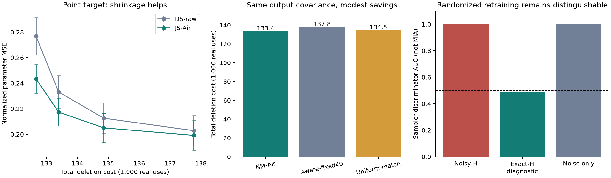

**채널 잡음 GPU 결과표 — 2026-09-27**

통계는 noise를 seed 안에서 평균한 뒤 3개 데이터 seed로 계산했다. 모든 수치와 seed별 평균/표준편차는 results/summary.json에 있다. 주 표는20dB,tau=.003,실제 OTA Hessian32 조건이다.

| 방법 | 조건부 KL 평균 | 공분산 KL | Point MSE 비율(이론 기대값) | Forget JS 비율 | Test accuracy | 총 삭제 real uses |
|---|---:|---:|---:|---:|---:|---:|
|NM-Air|1186.1700|0.0000|0.244412|0.016462|69.331%|133,382.4|
|Uniform-match|1186.1700|0.0000|0.244412|0.016462|69.331%|134,546.3|
|Aware-fixed40|1186.1700|0.0000|0.244412|0.017176|69.324%|137,776.0|
|DS-fixed40|1494.0250|307.8550|0.201098|0.007838|69.333%|137,776.0|
|Naive-add40|1191.1435|4.9735|0.253807|0.020319|69.321%|137,776.0|
|Noise-only|6177.3550|0.0000|1.052709|1.013623|70.711%|별도 software 진단|

NM-Air 비용 절감=3.189%. 같은 tau의 randomized retrain accuracy=69.433%. 사전 판정=False.
조건부 KL/TV의 평균은 주변 분포에 대한 상계이며 실제 주변 KL/TV의 측정값이 아니다. Noise-only는 source에 software noise만 넣은 반례로 RF 비용 경쟁 방식이 아니다. Point MSE와 JS의 reference는 깨끗한 retained ridge이고,KL의 reference는 사전에 고정한 randomized ridge다.

**모든 NM-Air 설정: OTA32만**

| SNR | tau | 총 삭제비 | Aware-fixed40 대비 절감 | 조건부 KL 평균 | TV 상계 평균 |
|---|---:|---:|---:|---:|---:|
|10|0.001|390,619.3|0.000%|78308.4209|1.000000|
|10|0.003|205,771.5|0.000%|8972.1263|1.000000|
|10|0.01|184,583.5|1.771%|1074.5666|1.000000|
|20|0.001|142,321.9|0.000%|10314.7417|1.000000|
|20|0.003|133,382.4|3.189%|1186.1700|1.000000|
|20|0.01|132,657.2|3.715%|155.3123|1.000000|
|30|0.001|115,065.0|3.933%|991.1056|1.000000|
|30|0.003|114,656.8|4.274%|114.6817|1.000000|
|30|0.01|114,656.8|4.274%|15.7838|0.994350|

**Deterministic reference: JS-Air와 동일 비용의 raw 비교**

| SNR | 총 반복 | Raw MSE 비율 | JS-Air MSE 비율 | 감소율 | 동일 총 삭제비 |
|---|---:|---:|---:|---:|---:|
|10|5|3.191460|1.342185|57.944%|182,792.0|
|10|10|2.227656|1.469379|34.039%|183,523.2|
|10|20|1.835563|1.476822|19.544%|184,985.7|
|10|40|1.646683|1.471794|10.621%|187,910.7|
|20|5|0.276772|0.243447|12.041%|132,657.2|
|20|10|0.233176|0.217391|6.770%|133,388.5|
|20|20|0.212598|0.204998|3.575%|134,851.0|
|20|40|0.202782|0.199103|1.814%|137,776.0|
|30|5|0.025234|0.024923|1.230%|114,656.8|
|30|10|0.021545|0.021301|1.131%|115,388.0|
|30|20|0.020024|0.019915|0.546%|116,850.5|
|30|40|0.019293|0.019239|0.281%|119,775.5|

10dB는 JS-Air로 개선되어도 MSE 비율이1보다 크다. No-op보다 나쁜 조건을 언러닝 성공으로 표시하지 않는다. JS-Air는 결정론적 보정의 통계적 추정 개선이며 randomized reference의 Gaussian law를 유지하지 않는다.

**Hessian oracle 진단 — 무선 실험 성과와 구분**

| 방식 | KL 평균 | TV 평균 | Point MSE 비율 |
|---|---:|---:|---:|
|NM-Air|6.35066267e-10|1.39523044e-05|0.052709|
|Aware-fixed40|6.35066267e-10|1.39523044e-05|0.052709|
|DS-fixed40|412.263652|1|0.006790|
|Naive-add40|2.89307224|1|0.059499|

Oracle는 Hessian 수집 잡음을 없앤 원인 진단이다. 이 결과에 기록된 통신 원장은 가상 비교용이며 실제 장비에서 같은 비용으로 정확한 곡률을 얻었다는 주장이 아니다.

추가 sampler 구분 검사와 잡음 분산 오보정/추정비용은 results/diagnosis.json, 해석과 수식은 METHOD_KO.md와 README_KO.md를 참고한다.
