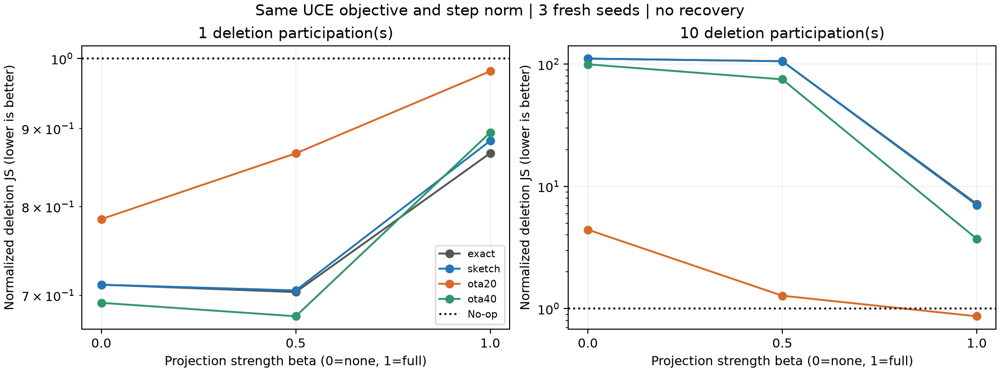

**완전 직교화는 마지막 1회 삭제 보정의 필수조건이 아니었다. 다만 직교화를 없애고 반복하는 방법은 실패했다.**

2026-09-27. RTX3080에서 새 seed381/382/383, FashionMNIST, client0 전체 삭제를 실험했다. 학습 source3개와 seed별 retained reference2개(총6개)를 새로 준비했다. 99개 삭제 trajectory, step1/10의198개 평가를 끝냈다. 모든 사전 조건·실패 결과를 보존했다.

**무엇만 바꿨는가**

기존 Legacy-Sketch-V1의 UCE 삭제 gradient와 weighted AirComp를 유지하고 투영 강도만 바꿨다. 잔존 gradient span으로의 정사영을 P라 하면

`v_beta = u - beta * P u`, beta=0 / .5 / 1.

0은 투영 없음, .5는 직교 성분 제거를 절반만 적용,1은 원래 완전 투영이다. 주 비교는 각 step의 보정 norm을 해당 A gradient norm으로 맞추고 lr=.01을 동일하게 사용했다. 같은 출발점의 첫 step은 실제 이동거리도 같으므로, 덜 움직여 좋은 것만으로 결과를 설명할 수 없다. 10step에서는 trajectory별 모델이 달라져 이후 target gradient norm도 달라질 수 있다.

각 client는 고정 공개 SRHT2048의16bit sketch를 전송한다. 서버는 계수만 계산·방송하고, 각 client가 자신의 로컬 unit gradient에 계수를 곱해 동일 자원에 동시 송신한다. 모델 공간의 투영 강도를 바꾼 것이며 CDMA/OFDMA를 추가하지 않았다. beta0은 나머지 client 계수가0인 A-only 대조군이다.

**A가 마지막 한 번 참여했을 때**

오차=forget prediction JS / 미삭제 모델의 JS이며,1은 미삭제 상태,0은 target-free reference0과 같은 예측이다. 숫자는 noise를 seed 안에서 평균한 뒤3seed 평균이다.

| 조건 | 투영 없음 β=0 | 부분 β=.5 | 완전 β=1 | 부분의 완전 대비 오차 감소 |
|---|---:|---:|---:|---:|
| 정확한 projection oracle | .7114 | **.7035** | .8672 |18.9%|
| Sketch + 무잡음 합산 | .7114 | **.7053** | .8835 |20.2%|
| Sketch + AirComp20dB | .7852 | **.8670** | .9812 |11.6%|
| Sketch + AirComp40dB | .6922 | **.6784** | .8947 |24.2%|

굵게 표시한 값은 부분 투영 후보이며 각 행의 최솟값을 뜻하지 않는다. beta0은 A의 개별 방향이 그대로 노출되는 대조군이므로 배포 후보로 채택하지 않는다.

부분 투영은 주 reference에 대해3seed 모두 완전 투영보다 낮았다. 무잡음에서도 차이가 있어 모든 이득을 무선 잡음의 우연한 효과로 볼 수 없다. 20dB에서 부분 투영의 test accuracy는75.61%,미삭제75.61%였다.40dB에서는75.65%였다.

**통신 자원은 beta별로 같았다.** 20dB에서 model DL·sketch UL·pilot·metadata·feedback·최종 모델 DL 포함1,557,477 real uses였다.40dB는 같은 payload를 더 높은 goodput로 환산하면816,134이며,20dB goodput로 고정 환산하면 동일하게1,557,477이다.40dB 결과를 동일 채널에서 공짜로 얻은 개선이라고 하지 않는다.

**직교화가 AirComp에 준 영향**

| 첫 step,20dB | 부분 β=.5 | 완전 β=1 |
|---|---:|---:|
| 이상적 residual norm | .6049 | .3960 |
| 수신/이상적 방향 cosine | .1741 | .0896 |
| noise norm / signal norm |5.7281|11.2500|
| 실제 수신 방향의 최대 잔존-gradient cosine 절댓값 |.0867|.0069|

이 조건에서는 완전 projection이 유효 residual을 작게 만들었고, 송신의 peak 전력 제한 아래 잡음의 상대 크기가 더 컸다. 20dB의 수신 방향은 두 방법 모두 이상적 방향과 상당히 다르다. 특히 완전 투영 수신 방향이 잔존 gradient와 거의 직교라는 숫자만으로 투영 구현 성공을 판단하면 안 된다. 큰 고차원 잡음도 작은 cosine을 만들 수 있다.

40dB의 수신/이상적 cosine은 부분 .8669,완전 .6675였다. 정확한 projection 및 noiseless sketch 결과와 함께 보면, 이 설정의 1회 보정에서 완전 직교성은 삭제 품질을 위한 필수 제약이 아니었다. 이것은 ‘모든 FU에서 직교화 불필요’의 증명이 아니다.

**10번 반복하면 결론이 달라졌다**

| 조건 | 투영 없음 | 부분 | 완전 |
|---|---:|---:|---:|
| Sketch + 무잡음 |111.2089|105.7914|7.0502|
| AirComp20dB |4.4337|1.2773|.8672|
| AirComp40dB |99.8334|75.2543|3.7255|

10step은 A가10번 참여한 확장이며 마지막1회 참여와 구분한다. 무잡음 부분 투영의 test accuracy는64.83%,forget accuracy는47.69%까지 떨어졌다. 완전 투영에서는75.06%/78.94%였다. Target-free reference0의 평균 forget accuracy는79.50%다. 삭제 대상 데이터의 정답률을 계속 낮추는 것과 해당 client 없이 학습한 상태에 가까워지는 것은 같지 않다.

이 결과는 완전 projection이 이 UCE 반복에서 과도한 변경을 억제하는 역할을 했다는 근거다. 그럼에도 무잡음 완전 투영의 오차도7.05여서 이 고정10step은 성공한 삭제가 아니다. Raw-scale ablation에서도10step 부분27.35,완전1.762로 모두1을 넘었다. Target-norm 재정규화 하나만의 문제는 아니었다. 별도의 학습률/종료 탐색이나 retain recovery를 추가하지 않았다.

**재학습 기준 변동과 삭제 판정의 한계**

- 주 reference의 사전 탐색 기준(평균<.8,3seed 모두<1)을1회 부분 투영의 무잡음/40dB는 통과했고20dB는 통과하지 못했다.
- 독립 minibatch stream의 reference1에서는1회 부분/완전의 평균이20dB .9594/.9959,40dB .9177/.9879였다. 평균 비교 방향은 유지됐지만,40dB seed381은 부분1.046/완전1.018로 부분이 더 나빴다. 모든 reference·seed에서 우월하다고 하지 않는다.
- Reference끼리의 forget JS는 .003854/.001966/.001652,source와 주 reference의 JS는 .000684/.001026/.001480이었다. 이처럼 학습 변동이 삭제 전 격차보다 클 수 있으므로 예측 JS 개선을 완전 삭제나 재학습 분포 일치로 확대하지 않는다.
- Parameter squared-distance ratio는1회 부분 투영에서20dB1.00105,40dB.99866이었다. 예측 오차 개선과 parameter-level 삭제 일치는 별개의 결과다. Loss-MIA는 source/결과부터 약.51대로 판별력이 약했다.
- 직전 대화의 CE 정상점 반례는 수학적으로 확인했다(β0/.5/1 잔여 제곱오차0/.25/1). 하지만 이번CNN의 full-data CE 정상점 잔차비는.606~.729로 작지 않았다. CE aggregate에 대한 투영 잔차도.930~.994였다. 따라서 그 반례의 ‘정확히0으로 소멸’이 이번CNN에서 발생했다고 설명하지 않는다.

**정보 공개와 유지할 방향**

beta0은 A-only,exact oracle은 full client gradient 공개이므로 정보 제약을 만족하는 제안이 아니다. 부분 투영은 다른 client도 함께 송신하지만 sketch·norm·합산 보정 공개가 남는다. 같은 고정sketch를 쓰고 동일gradient에 다수의 독립 혼합을 실제로 공개하지 않지만, 이것만으로 full-transcript 비복원이나 DP를 증명하지 않는다. 수치 실험의 여러 beta 결과를 하나의 실서비스 서버가 모두 수신하는 프로토콜로 해석하지 않는다.

유지할 실험 후보는 **마지막1회 참여에서 부분 투영을 적용하는 기존 sketch/weighted-AirComp 변형**이다. 완전 직교성을 필수조건으로 삼지 않아도 된다는 제한된 근거가 나왔다. 직교화를 완전히 제거한 배포안이나 반복 UCE 삭제를 채택할 근거는 없다. 이번 결과를 새로운 알고리즘의 노벨티로 주장하지 않는다.

실행 검증: 정확한 projection의 최대 잔존 cosine1.49e-7,FP32 MAC 최대 절대오차4.85e-8,송신 평균power<=1/peak<=4를 float32 허용오차 안에서 확인했다. beta0 raw와norm 보정의10step 모델 차이는 최대1.49e-8이었다. 초기 검증의 절대 normalized-JS 허용오차1e-5는 큰 오차비(~176)에 비해 엄격해 실패했고, model 차이를 확인한 뒤 상대오차1e-6로 수치 동치 검사를 수정했다. 실험 코드·조건·결과는 수정하지 않았다. Source/reference 준비 GPU simulator110.7초,삭제99trajectory40.2초였다.

[사전 조건](PROTOCOL_KO.md) · [전체 표·표준편차](RESULT_TABLES_KO.md) · [실험 코드](run_experiment.py) · [원자료 요약](results/summary.json)
