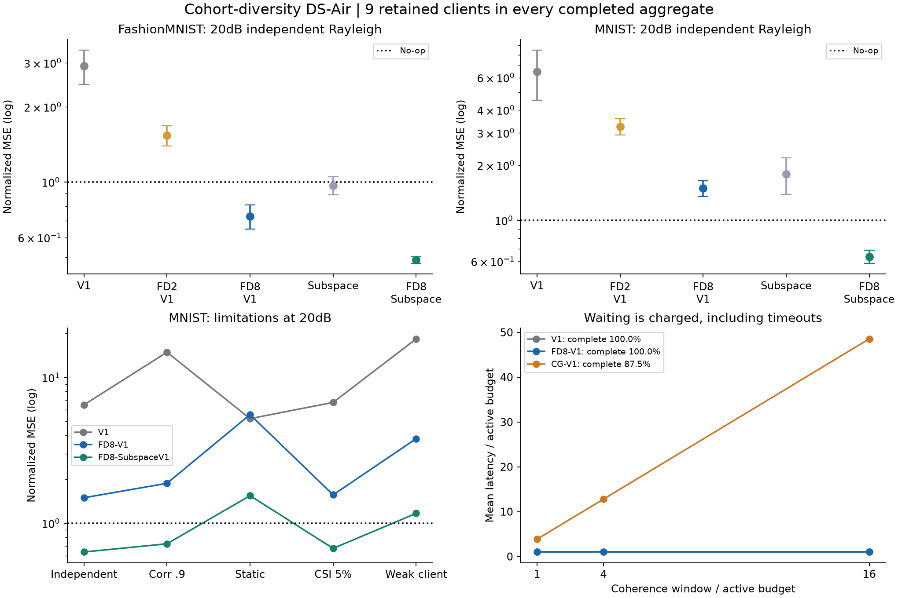

# DS-Air deep-fade 보완: Cohort Diversity

**주파수 선택을 결합한 부분공간 방식 `FD8-SubspaceV1`을 후속 후보로 남긴다.** 잔존9개 client를 모두 포함하고 탐색비까지 낸 같은 active 통신 예산에서, 20dB independent Rayleigh의 기존 Subspace 대비 오차가 FashionMNIST49.7%, MNIST64.5% 줄었다. 두 데이터셋 모두 3개 seed 평균이 미삭제 기준보다 낮고 사전에 고정한 탐색 기준을 통과했다.

다만 모든 채널 표본의 성공, 정확한 언러닝, 프라이버시 보장은 아니다. 동일한 채널밖에 없거나 한 client의 경로손실이 큰 조건은 실패도 기록했다. 대기 방식은 미완료와 지연이 커서 주 방법으로 채택하지 않는다.

- [알고리즘·수식·통신비·선행연구](METHOD_KO.md)
- [실행 전 고정한 프로토콜](PROTOCOL_KO.md)
- [전체108개 조건/방법 결과표](RESULT_TABLES_KO.md)
- [GPU 구현](run_experiment.py), [집계·감사](summarize.py), [FP32 feedback 결정 감사](audit_feedback.py)
- [수학 검사](results/math_checks.json), [전체 원장 검사](results/verification.json), [feedback 검사](results/feedback_verification.json), [환경과 실행 기록](results/completion.json), [요약 JSON](results/summary.json)

## 무엇을 보완했는가

기존 DS에서는 한 client가 deep fade에 걸리면 전원 공중 합산의 scale이 커져 Hessian 추정이 무너졌다. 그 client를 빼면 retained 집합 자체가 달라진다. 이를 피하기 위해 **같이 합산할 무선 자원**을 바꾼다.

- **FD8:** 동시에 이용 가능한 공유 주파수 후보8개를 탐색하고, 9명 중 가장 약한 link가 가장 좋은 후보 하나를 고른다. 이후9명이 그 동일 자원에서 합산한다. 개인별 직교 채널 배정이 아니다.
- **FD8-SubspaceV1:** FD8과 기존 고정 r48 부분공간을 결합한다. 곡률 준비비를 줄여 얻은 반복 예산과 deep-fade 완화를 함께 사용한다.
- **CG:** 현재 채널이 모두 threshold .4 이상일 때까지 최대8개 coherence window를 기다린다. 시간 순서대로 탐색하며, 실패하면 모델을 갱신하지 않고 삭제를 pending으로 남긴다.

공개 고정 encoder + ridge head라는 기존 범위 안의 보완이다. A의 과거 update 차감이나 신경망 전체의 학습 경로 복원으로 확대하지 않는다.

## 새 GPU 실험의 범위

FashionMNIST와 MNIST 각각 private10,000/test10,000, label-2 client10개 중0 삭제, D64(공개 feature63+bias), lambda=.01. 새 partition seed202609284/285/286, 조건당32개의 channel/H draw, draw당16개의 correction noise를 사용했다. 정확도/forget JS는 각 draw의 사전 고정 첫 noise1개로 전체 평가 데이터를 사용했다.

6개 채널 조건 x 9개 방법 x 3seed x 32draw x 2dataset = **10,368행**이다. RTX3080 10GB에서 단일 process로 실행했고, 구간 경과 시간87.12초, CUDA 최대 할당464,960,000byte(약.433GiB)였다. 이는 작은 고정 feature head 실험이며 대형 모델 학습비나 순수 kernel 시간은 아니다.

기존 코드를 변경하지 않고 frozen ridge/PHY 함수를 불러왔다. 이번에는 channel draw를4개에서32개로 늘리고 source seed도 새로 썼다. 아래 개선율은 **이번 실험 내부의 같은 source/channel/noise에 대한 비교**다. 이전 보고서의 MNIST14.2273 등과 직접 비교해 개선율을 계산하면 안 된다.

## 주 결과: 20dB independent Rayleigh

오차 E는 `출력과 정확한 retained ridge의 parameter 제곱거리 / 미삭제 모델과 retained ridge의 제곱거리`다. **미삭제=1, retained ridge=0, 작을수록 좋다.** ±는 seed 안에서32draw를 평균한 뒤 계산한3seed SD다.

| 방법 | FashionMNIST E ± SD | MNIST E ± SD | active 통신비 |
|---|---:|---:|---:|
|Original|3.3783 ± .4978|7.3192 ± 2.1650|133,837|
|V1|2.9150 ± .4577|6.4882 ± 1.9765|133,809|
|FD2-V1|1.5399 ± .1435|3.2532 ± .3294|133,830|
|FD8-Original|.8606 ± .0960|1.7009 ± .1721|133,758|
|FD8-V1|.7298 ± .0811|1.4968 ± .1494|133,820|
|SubspaceV1|.9695 ± .0814|1.7897 ± .4002|133,806|
|**FD8-SubspaceV1**|**.4873 ± .0148**|**.6360 ± .0520**|**133,817**|

위 표는 주파수 선택 방식의 비교이며, CG의 미완료율과 지연은 아래에 별도로 보고한다.

모든 방식의 공통 active 예산은133,837.14 real channel-use equivalent다. 탐색 pilot, CSI feedback, 선택 지시, Hessian, 기저/고유값, residual, 최종 모델, CP를 포함한다. 정수 반복 때문에 실제 소비량은 약간 다르다. 동일 예산에서의 오차 개선이며 총비용 절감으로 표현하지 않는다.

| FD8-SubspaceV1 평가 | FashionMNIST | MNIST |
|---|---:|---:|
|기존 Subspace 대비 오차 감소|49.7%|64.5%|
|미삭제 대비 오차 감소|51.3%|36.4%|
|seed별 E|.4995 / .4709 / .4915|.5929 / .6213 / .6937|
|96개 session 중 평균 E<1|96/96|92/96|
|Test accuracy|69.534%|71.975%|
|Retained reference accuracy|69.357%|71.943%|
|forget prediction JS 비율|.01586|.01625|

MNIST의4개 session은 E>=1이었다. 전송을 완료한 것과 삭제가 정확히 성공한 것은 구분한다. 이 표는 모델 분포 indistinguishability나 membership privacy를 보장하지 않는다. `FD8-V1`은 FashionMNIST에서는 사전 기준을 통과했지만 MNIST에서는 E>1 및 accuracy 하락으로 실패했다. 현재20dB 주 조건의 후보는 **FD8과 부분공간을 함께 쓴 방법**이다.

## 왜 나아졌는가

정확한 CSI에서 min-client gain 제곱을 m_l, 후보 중 최댓값을 M_L이라 하면

\[
P(M_L\le x)=(1-e^{-9x})^L.
\]

단일 자원의 E[1/M_1]은 발산한다. 독립 후보가2개 이상이면 유한해지며,8개에서는4.044다. 100,000회 Monte Carlo는4.034로 확인됐다. 이는 어려운 client를 빼지 않고도 역변환 잡음의 heavy tail을 완화하는 근거다. 자세한 유도와 적용 조건은 방법 문서에 있다.

곡률에 조건부인 평균 오차도 줄었다.

| Subspace → FD8-Subspace | 평균 오차 항 | correction 잡음 항 |
|---|---:|---:|
|FashionMNIST|.9499 → .4859|.01928 → .00140|
|MNIST|1.7428 → .6341|.04573 → .00184|

추가 탐색비를 낸 뒤라 보정 반복은639회에서625회로 줄었다. 따라서 반복 횟수를 몰래 늘려 얻은 개선은 아니다. Hessian이 더 안정적인 채널에서 합산되는 효과가 크다. 반대로 full 방식은 여전히 곡률 오차가 커서 MNIST에서 실패했다.

## 대기 방식: 비용과 timeout을 포함하면 불리하다

CG는 최대8번의 window에서 전원이 threshold 이상인지 확인한다. 아래 E는 pending도1로 포함한 평균이다. 완료율은 **요청한 무선 집계를 끝낸 비율**이며 삭제 인증 성공률이 아니다.

| 방식 / 데이터 | E | 전송 완료율 | 평균 지연 / active 예산 |
|---|---:|---:|---:|
|CG-V1 / FashionMNIST|.7926|89.58%|3.570배|
|CG-Subspace / FashionMNIST|.5468|89.58%|3.570배|
|CG-V1 / MNIST|1.4278|87.50%|3.851배|
|CG-Subspace / MNIST|.6839|87.50%|3.851배|

이는 coherence window를 active 예산1배로 둔 가장 짧은 가정이다. 4배 길이의 window면 평균 지연은 FashionMNIST11.60배, MNIST12.79배로 늘고,16배면43.73배/48.54배다. Timeout도 전부 기다린 시간으로 포함했다.

독립 Rayleigh의 이론적8시도 완료율은88.50%다. 채널이 정적이거나 특정 client의 경로손실이 크면 기다려도 해결되지 않는다. CG의 낮은 평균 active 비용은 미완료 요청이 전송을 생략한 효과를 포함하므로 효율 개선으로 채택하지 않는다.

## 유지되는 조건과 실패 조건

| FD8-Subspace 조건 | FashionMNIST E | MNIST E | 해석 |
|---|---:|---:|---|
|20dB 독립 후보|.4873|.6360|두 dataset의 사전 주 기준 통과|
|후보 complex 상관.9|.5303|.7238|평균 개선 유지, MNIST 개별 실패 존재|
|동일한 정적 후보|1.2995|1.5468|diversity 없음, 두 dataset 모두 실패|
|5% amplitude CSI 오차|.5093|.6732|평균 개선 유지, 실제 채널은 정확CSI 조건과 paired|
|한 client amplitude.2|.6929|1.1702|MNIST 실패: 큰 경로손실은 미해결|
|30dB 독립 후보|.3823|.3814|부분공간 잔차가 남음|

30dB에서는 FD8-V1이 .0886/.2025로 부분공간보다 좋았다. 따라서 부분공간이 언제나 최선이라는 결론도 아니다. SNR에 따라 결과를 보고 방법을 자동 선택하는 알고리즘은 이번에 구현하지 않았다.

FD는 동시에 쓸 수 있는 주파수 후보8개, 충분한 coherence bandwidth 간격, 세션 동안 채널 안정성 및 비선택 자원의 반환을 가정한다. 8개 band를 계속 독점 예약해야 한다면 동일 점유비 비교가 성립하지 않는다. OFDM/SDR 실측, packet error, 튜닝/계산 지연, cross-band 간섭을 포함한 시스템 검증은 남아 있다.

## 프라이버시와 논문 판단

부분공간으로 full-gradient 비식별 방향을 남기는 기존 구조는 유지했지만 **전체 transcript 프라이버시는 해결하지 않았다.** 잡음이 줄어 projected-gradient 복원이 오히려 쉬워졌다. 20dB 주 조건에서 해당 공격의 상대 MSE는 FashionMNIST `.09718 → .01309`, MNIST `.15010 → .01526`이다(작을수록 공격자가 잘 복원함). 채널 품질 개선을 프라이버시 개선이라고 보고하면 안 된다.

실험적 보완으로는 FD8-Subspace를 유지할 근거가 생겼다. 하지만 diversity/resource selection은 일반 FL에도 쓰이는 원리여서, 이것만으로 새로운 언러닝 알고리즘의 신규성이 확보되었다고 판단하지 않는다. [선행연구와의 관계](METHOD_KO.md)를 구분해 기록했다. 국내 학회용 주장도 '전원 참여 제약, 곡률 오차, 탐색비를 포함한 삭제 품질'로 한정하고, 더 강한 자원할당/combining 비교와 현실적인 coherence 검증이 필요하다.

## 재현

CUDA PyTorch, NumPy, IDX 데이터가 필요하다. 그림 생성만 Matplotlib을 쓴다. 기존 결과를 보존하려면 저장소 복사본에서 GPU 명령을 실행한다.

```bash
python research_20260928_cohort_diversity/run_experiment.py --stage math
python research_20260928_cohort_diversity/run_experiment.py --stage run --fashion /path/to/FashionMNIST/raw --mnist /path/to/MNIST/raw
python research_20260928_cohort_diversity/audit_feedback.py
python research_20260928_cohort_diversity/summarize.py --plots
```

실행 환경은 `CUBLAS_WORKSPACE_CONFIG=:4096:8`, TF32 off였다. 요약/원장 감사만 수행할 때는 GPU 및 외부 패키지 없이 `summarize.py`를 실행한다(`--plots` 제외). 재사용하는 이전 코드와 이번 실행 코드/protocol SHA256을 math/run에 함께 저장했다. 데이터셋·checkpoint·개별 gradient는 업로드하지 않았다.

검증은10,368행의 active 예산, 전력, 전원 참여, 지연 원장, bias+variance 식, code/protocol hash 및 timeout 처리를 통과했다. FP32 CSI feedback으로 band/threshold 결정을 다시 계산해도 변경0개였다. 이 검증은 구현 감사이며 개인정보 보호나 정확한 언러닝 인증이 아니다.



위쪽 error bar는3seed SD이며, 아래쪽 곡선은 조건별 평균이다. [벡터 PDF](comparison.pdf)와 전체 JSON도 제공한다.
