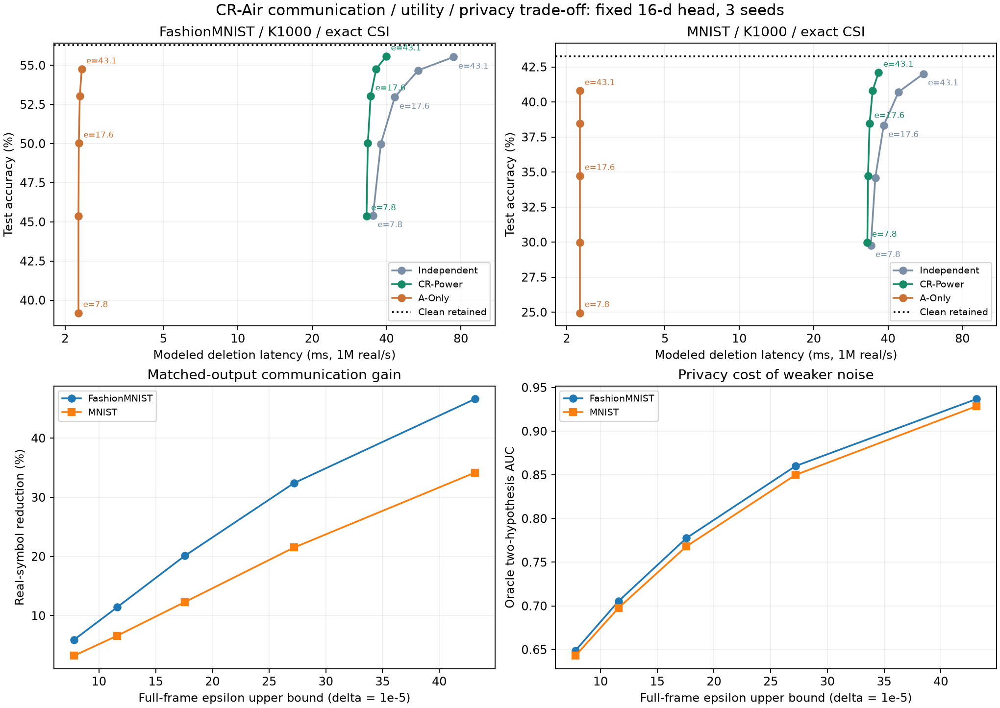

# CR-Air: 통신·정확도·프라이버시 trade-off 검증

2026-09-28. **특정 조건에서 통신 trade-off를 개선했다는 실험 근거는 있다. 새로운 trade-off의 최초 발견, 강한 프라이버시, 실용적인 일반 신경망 언러닝을 입증한 결과는 아니다.** 국내 학회 단기 논문의 예비 결과로 검토할 수 있으나, 현재 약한 classifier와 정확 CSI 가정만으로 논문 기여가 충분하다고 확정하지 않는다.

사용자의 통신 효과 측정·프라이버시 강도 완화 요청에 따라 이전 실패 실험을 보존하고 새 seed 3개로 후속 평가했다. 사전 기준은 두 데이터셋에서 clean retained 대비 정확도 손실 ≤5%p, Independent 대비 총 삭제 symbol ≥10% 감소였다. CR-Power/CR-Uses는 아래 ε≈17.57 단계에서 처음 통과한다. 이 기준은 연구의 feasibility 기준이며 개인정보 보호 적정성이나 학회 채택 기준이 아니다.

**프라이버시 정정:** 실제 복사한 cyclic prefix도 서버가 볼 수 있다는 점을 실행 후 감사에서 발견했다. 동결 protocol/raw JSON의 nominal privacy 값은 prefix를 버린 payload 기준이다. [보정 수학과 코드](PRIVACY_CORRECTION_KO.md)를 추가했으며, 이 보고서·결과표·그림에는 prefix까지 포함한 보수적 상한을 사용한다. 앞서 nominal ε≈11.60으로 표시했던 대표 결과의 최종 상한은 **ε≈17.57**이다. 정확도·통신 수치를 변경하거나 결과에 맞춰 모델을 다시 조정하지 않았다.

- [전체 결과표](RESULT_TABLES_KO.md), [집계 JSON](results/summary.json)
- [실행 전 protocol](PROTOCOL_KO.md), [프라이버시 정정](PRIVACY_CORRECTION_KO.md)
- [원 실행 코드](run_experiment.py), [전체 frame 감사](audit_full_frame.py), [집계·검증 코드](summarize.py)
- [완료 기록](results/completion.json), [검산 기록](results/verification.json), [전체 frame privacy](results/full_frame_accounting.json)

## 1. 어떤 방법인가

CR-Air는 Correlated Refresh over AirComp의 가칭이다. 공개 고정 특징 추출기와 작은 ridge head를 사용한다. 각 client는 자신의 Gram/moment를 하나의 벡터로 연결하고 L2 norm B=1로 clipping한 충분통계 s_i를 보관한다. A를 제외한 합을 S_R라고 둔다.

\[
Y_0=S_R+s_A+Z_0,\qquad Z_0\sim\mathcal N(0,vI).
\]

삭제 때 A는 −βs_A, 잔존 client는 (1−β)s_i를 같은 무선 자원에서 전송한다. 채널 보상·scale·반복 수를 정해 수신하면

\[
U=(1-\beta)S_R-\beta s_A+Z_1,\quad
Z_1\sim\mathcal N(0,(1-\beta^2)vI),\quad Z_1\perp Z_0.
\]

\[
Y_1=\beta Y_0+U=S_R+\beta Z_0+Z_1\sim\mathcal N(S_R,vI).
\]

서버는 Y_1에서 같은 PSD 보정/ridge decoder로 head를 계산한다. 따라서 **사전에 정한 noisy·clipped head learner의 retained-only 재학습과 최종 모델의 주변분포가 일치**한다. 잡음이 평균 영향을 지우는 것이 아니라 신호가 A 항을 상쇄하고, 잡음이 서버의 개별 기여 추론을 제한한다. Gram–Schmidt, client 간 통신, 개별 gradient 공개가 필요하지 않다.

이것은 기존 private backbone의 비선형 학습 경로를 되돌리는 해법이 아니다. encoder는 공개·고정이며 clipping·PSD 보정·고정 초기 K 정규화도 원래 learner와 reference 양쪽에 포함된다. 과거 Y_0를 지워 버리거나 Y_0에 조건부로 독립 재학습을 재현한다는 주장도 아니다. 삭제 대상의 신원은 공개이고, 한 번의 고정된 삭제 요청만 분석했다.

## 2. 무엇과 무엇의 trade-off인가

prefix가 없는 식에서는 ρ_0=2B²/v일 때 삭제 client의 전체 관측 비용이 ρ_A=ρ_0/(1−β²), 잔존 client는 ρ_R=2ρ_0/(1+β)이다. 이번 copied prefix까지 포함한 보수적 상한은 이 값의 2배다. 큰 β는 잔존 client의 보충 송신을 줄이지만 A의 privacy 비용을 높인다. β→1이면 원래 final variance를 유지하는 구조에서는 A의 privacy 비용이 발산한다.

또한 허용 privacy 비용을 높여 v를 줄이면 정확도가 올라가는 대신, 같은 수신 noise floor에서 작은 aggregate noise를 만들기 위한 전력 또는 반복 전송 부담이 커진다. CR은 β를 채널에 맞춰 골라 그 부담을 줄인다.

\[
r(\beta)=\max\left(1,\left\lceil
\frac{\nu^2\max(\beta^2a_A^2,(1-\beta)^2a_R^2)}{(1-\beta^2)v}
\right\rceil\right),\qquad
a_A=\frac{B}{|h_A|\sqrt{P_A}},\quad
a_R=\max_{i\ne A}\frac{B}{|h_i|\sqrt{P_i}}.
\]

CR-Uses는 공개 채널·bound로 β=a_R/(a_A+a_R)를 허용 구간으로 clip한다. CR-Power는 공개 payload energy 상한의 최적 β를 쓴다. 이 실행의 구간은 [0,√0.5]이다. K1000에서는 대부분 상한에 도달하므로 두 방법의 결과가 거의 같았다. 별개의 새로운 언러닝 알고리즘 두 개를 검증했다는 의미는 아니다.

비교 방법은 Independent(독립 retained 재집계, β=0), CR-Fixed(β=.5), CR-Power, CR-Uses, A-Only이다. 앞의 네 방법은 같은 source 및 final noise law를 사용하고 전체 client privacy의 **공통 상한**을 만족한다. 각 client의 실제 privacy 비용까지 같지는 않다. 특히 CR-Power는 Independent보다 A의 보호를 약하게 쓰고 잔존 client의 관측 비용을 줄이는 선택이다.

## 3. 대표 결과

MNIST/FashionMNIST 각각 private 10,000/test 10,000, 공개 random-ReLU 15차원+bias, label-2 분할, K=1000(삭제 A의 sample 10개), seed 3개, seed당 16개 Rayleigh 채널, 정확 CSI 조건이다. channel당 Gaussian 8회 중 2회로 전체 test 정확도를 평가했다. 아래는 seed/channel 평균이다. ε는 δ=10⁻⁵의 full-frame client replacement DP 상한이다.

| Full-frame ε 상한 | 데이터 | Independent 정확도 / 지연 | CR-Power 정확도 / 지연 | 삭제 전송량 절감 |
|---:|---|---:|---:|---:|
| 7.79 | FashionMNIST | 45.40% / 35.281 ms | 45.38% / 33.203 ms | 5.89% |
| 7.79 | MNIST | 29.76% / 34.088 ms | 29.97% / 32.995 ms | 3.21% |
| 17.57 | FashionMNIST | 52.96% / 43.204 ms | 53.03% / 34.514 ms | **20.11%** |
| 17.57 | MNIST | 38.32% / 38.417 ms | 38.45% / 33.696 ms | **12.29%** |
| 27.19 | FashionMNIST | 54.68% / 53.728 ms | 54.75% / 36.318 ms | 32.40% |
| 27.19 | MNIST | 40.72% / 44.147 ms | 40.79% / 34.653 ms | 21.51% |

지연은 정수 frame symbol 수를 **1M real/s로 환산**했다. 무선 장비에서 측정한 ms가 아니다. 입력 symbol rate를 100k/10M real/s로 바꾸면 지연은 각각 10배/0.1배다. GPU 계산 시간과 구분해야 한다.

ε≈17.57에서 clean retained 정확도는 FashionMNIST 56.30%, MNIST 43.27%이며 CR의 손실은 3.27/4.82%p다. 각 seed의 손실도 모두 5%p 이내였다. 정확도 seed SD는 0.294/0.332%p다. Independent와 CR은 출력분포가 같으므로 +0.064/+0.123%p의 작은 차이를 정확도 개선 효과로 주장하지 않는다.

이 단계의 추가 지표:

| 지표 | FashionMNIST | MNIST |
|---|---:|---:|
| 삭제 symbol 평균 감소 | 20.11% | 12.29% |
| session별 symbol 비율 중앙값에서 감소 | **6.04%** | **5.59%** |
| p95 지연, Independent → CR | 73.658 → 39.706 ms | 48.466 → 35.410 ms |
| 더 적은 symbol을 쓴 session | 48/48 | 47/48 |
| source 준비 포함 lifecycle symbol 감소 | 10.62% | 4.80% |
| payload TX energy 감소 | 82.72% | 82.81% |
| pilot/control/head 포함 counted TX energy 감소 | **0.086%** | **0.051%** |
| full-frame oracle AUC, Independent → CR | 0.7055 → 0.7776 | 0.6978 → 0.7681 |

따라서 통신량·환산 지연의 이득은 주장할 근거가 있지만, 전체 에너지의 큰 절감이나 A privacy 자체의 개선을 주장할 수 없다. Oracle AUC는 실제 A 통계 대 빈 통계를 미리 아는 두 가설 검정으로, 일반 membership-inference 공격 성능을 뜻하지 않는다.



## 4. A만 보내는 강한 단순 비교군도 포함했다

A-Only는 Y_0에 A의 −s_A+Z_1만 더한다. Z_1의 분산도 v로 두면 최종 분산은 2v이고, 전체 관측 privacy는 같은 공통 상한 안에 들어간다. ε≈17.57 단계에서 다음과 같다.

| 데이터 | A-Only 정확도 / 지연 | CR-Power 정확도 / 지연 |
|---|---:|---:|
| FashionMNIST | 50.02% / 2.273 ms | 53.03% / 34.514 ms |
| MNIST | 34.74% / 2.266 ms | 38.45% / 33.696 ms |

**A-Only는 훨씬 빠르다.** CR은 이 비교군보다 약 3.01/3.71%p 정확도가 높고 원래 선언한 v 분산의 재학습 reference를 유지한다. A-Only도 A의 평균 항은 제거하지만 분산을 추가하는 별도 learner다. 원래 reference N(S_R,vI)에 대한 충분통계 KL은 q(1−log2)/2=45.41이고, 2v로 맞춘 다른 reference에 대한 KL은 0이다. 이 통계 KL을 classifier 출력 KL이라고 바꿔 부르지 않는다.

따라서 정확도·원래 reference 일치가 필요하면 CR, 더 큰 출력 noise를 허용하며 지연을 최소화하면 A-Only가 선택지가 된다. CR이 모든 비교군을 지배하거나 전역 Pareto frontier를 구했다고 주장하지 않는다. A-Only는 본 연구의 단순 비교 구현이며 특정 선행논문을 재현한 이름이 아니다.

## 5. AirComp 기여와 선행연구

| 선행연구 | 이미 다룬 부분 | 여기에서 남겨 볼 차이 |
|---|---|---|
| [Koda et al., 2020](https://arxiv.org/abs/2004.06337), Differentially Private AirComp Federated Learning with Power Adaptation Harnessing Receiver Noise | 수신 잡음으로 DP를 만들고 power/SNR/privacy 관계를 설계 | 삭제 전후 전체 관측, A/잔존의 서로 다른 제약, 동일 최종 noisy 재학습 law 아래 cancellation·refresh 계수와 repetition 설계 |
| [Upcycling Noise for Federated Unlearning, 2024](https://arxiv.org/abs/2412.05529) | DP 학습 잡음을 언러닝에 재사용·보정하는 방향 | 실제 OTA 합산, weak channel, 반복 수와 pilot/control 비용이 바꾸는 유효 조건 |
| [Exact Federated Continual Unlearning for Ridge Heads on Frozen Foundation Models, 2026](https://arxiv.org/html/2603.12977) | frozen features의 가산 충분통계 기반 head 삭제 | 서버가 학습·삭제 두 관측을 보더라도 privacy 비용을 제한하는 물리 수신 잡음/상관 갱신 |

이 차이 표는 후보 기여의 위치를 정리한 것으로, 완전한 선행연구 조사를 통한 신규성 증명이 아니다. 일반 FL에서도 통계 갱신 대수는 구현할 수 있다. **AirComp 기여는 채널·수신 noise floor·전력 cap·반복·제어비를 결합해 삭제 신호를 설계하는 부분**이다. 같은 digital FL baseline까지 직접 구현해 통신 우위를 확인하지 않았으므로 일반 FL 전체보다 우수하다는 비교 주장은 아직 불가능하다.

현 단계에서 쓸 수 있는 기여 문장:

> 고정 특징 기반 충분통계 학습에서 삭제 후 noisy 재학습 분포와 전체 수신 관측의 client-level privacy 상한을 유지하도록 공중 갱신 계수를 설계한다. 정확 CSI의 유한 Rayleigh 표본 실험에서 독립 재집계 대비 삭제 전송 자원을 줄였으며, 프라이버시 완화·추가 제어비·출력 noise에 따른 이득과 실패 조건을 정량화한다.

“무선 잡음으로 언러닝을 최초 구현”, “privacy–utility trade-off를 최초 발견”, “완벽 client privacy”, “기존 신경망의 모든 A 영향 제거”, “실측 지연 20% 개선”은 이번 증거를 넘어선다.

## 6. 어디에서 실패하거나 해석이 제한되는가

- **작은 client 수:** 같은 nominal ρ=2에서 CR-Power의 K10 정확도는 FashionMNIST 10.66%, MNIST 10.32%, K100은 19.48%/13.55%다. K1000 성공을 일반적인 소규모 FL로 확대할 수 없다. K를 바꾸면 A의 sample 수도 달라진다.
- **좋은 채널:** unit 채널에서는 baseline도 1회 전송이어서 airtime 개선이 없다. A의 추가 pilot/control 때문에 오히려 비용이 증가한다.
- **CSI 오차:** K1000, 5% log-amplitude error, nominal ρ=2에서 CR-Power의 보수적 privacy bound가 목표를 초과한 비율은 FashionMNIST 56.25%, MNIST 50.00%다. A 잔여 신호도 남는다. nominal exact-CSI 정리를 이 조건의 보장이라고 하지 않는다.
- **유한 표본/깊은 fading:** seed 3개×채널 16개인 48개 session의 평균이다. 완전 channel inversion을 한 untruncated Rayleigh에서는 E[1/|h|²]가 발산하므로, 이 평균을 모집단의 유한 기대 지연 보장으로 해석하면 안 된다. 중앙값 절감은 약 6%이고 p95도 표본 추정이다. timeout/dropout·coherence 내 완료를 보장하지 않는다.
- **약한 utility:** random feature head의 clean 정확도부터 낮다. 현재 숫자는 통신/분포 검증용 소형 실험이며 실용 classifier 수준을 입증하지 않는다. 높은 ε를 “조금 완화” 또는 충분한 보호로 부르지 않는다.
- **위협 모형:** honest-but-curious 단일 합산 수신기, 신뢰하는 물리 noise floor, 공개·데이터 독립 control/CSI, 한 번의 고정 삭제 요청이다. 추가 안테나·개별 신호 분리·client collusion·악의적 반복 질의·다중 삭제를 다루지 않았다.

국내 학회 원고로 좁히려면 공개 pretrained feature에서의 동일 head 검증과, bounded fading/CSI 오차를 반영한 유한 지연 설계 중 핵심 한 가지를 작은 추가 실험으로 보완하는 것이 적절하다. 이를 마치 이미 완료한 검증처럼 쓰지 않는다. 현재 상태는 **통신 설계 기여 후보를 지지하는 예비 결과**다.

## 7. 실제로 계산한 비용과 검증 범위

296 real payload와 실제로 복사한 37 real prefix를 r회 전송했다. UL pilot은 active client당 8+1 real, 공통 DL pilot은 8+1 real이다. control 480bit, client당 CSI feedback 64bit, head 5120bit를 따로 센다. digital effective rate는 .5log2(101)bit/real, data/prefix symbol 수는 각각 올림한다. payload cap=1은 한 client의 prefix 제외 vector 전체 에너지 cap이며 per-symbol 20dB가 아니다. ν²=.01이다.

pilot/DL energy를 real당 1로 둔 normalized TX ledger와 실제 prefix 복사 성분의 송신 에너지를 사용했다. RF circuit은 client payload real당 κ=0,10⁻⁶,10⁻⁴,.01의 민감도로만 평가했다. κ=10⁻⁴에서 TX+payload circuit 감소는 약 2.67%/1.48%다. 수신 회로, PA 효율, 실제 joule, 제어 링크 오류/재전송, 최초 noise-floor calibration은 측정하지 않았다. source 준비 비용은 lifecycle에 포함하되 공개 encoder는 seed로 사전 설치했다고 가정한다.

메인 GPU 실행은 RTX3080, Torch 2.11.0+cu128, 21,600개 집계행, 약 13.15초, peak allocation 455,717,888 bytes였다. raw waveform 24개 조건은 실제 반복 수신 tensor로 frame 길이와 잡음 분산을 확인했고 최대 상대 오차는 2.40%였다. 별도 full-frame CUDA privacy 감사는 약 1.31초였다. 이 계산 시간은 full backbone 학습 시간이나 실측 무선 지연이 아니다.

정확 CSI에서는 같은 잡음 coupling의 retained head 일치, A를 빈 통계로 바꾼 counterfactual 영향 제거, statistic reference KL, 전력/프레임 계수를 검산했다. 원래 reference의 statistic KL은 부동소수점 오차 수준(대표 평균 약 10⁻²⁷)이다. 분포 일치 증명의 근거는 1절 수식이고 유한 Monte Carlo의 KL 추정으로 완전성을 증명한 것이 아니다.

## 8. 재현

CUDA PyTorch, NumPy, Matplotlib이 필요하다. 이전 폴더의 `run_experiment.py`를 frozen helper로 import하므로 저장소 구조를 유지한다. 로컬 raw IDX 데이터 경로를 전달한다.

```powershell
python research_20260928_cr_comm_tradeoff/run_experiment.py --math
python research_20260928_cr_comm_tradeoff/run_experiment.py --fashion '<FashionMNIST/raw>' --mnist '<MNIST/raw>'
python research_20260928_cr_comm_tradeoff/audit_full_frame.py --fashion '<FashionMNIST/raw>' --mnist '<MNIST/raw>'
python research_20260928_cr_comm_tradeoff/summarize.py
```

원래 protocol/source/result는 보존하고 별도 privacy 감사를 추가했다. raw JSON의 nominal fields와 full-frame fields를 혼용하지 않는다. summary/verification의 `first_passing_nominal...` 또는 `first_passing` 내부 key 2는 full-frame ρ=4, ε≈17.57에 해당한다. 원자료·개별 통계·모델 checkpoint는 공개 파일에 포함하지 않았다. `ARTIFACT_MANIFEST.json`은 공개 파일의 hash와 크기를 기록한다.
