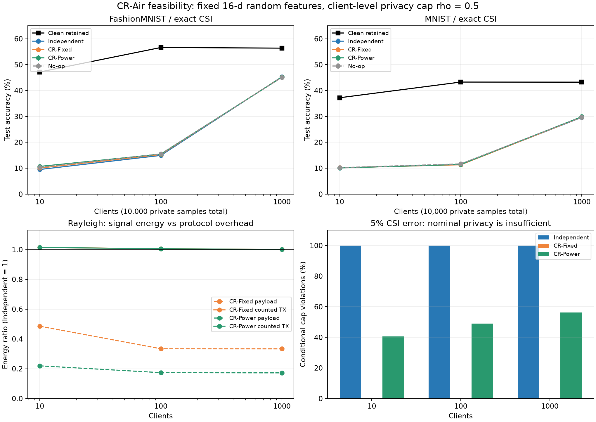

# CR-Air 실제 데이터 GPU 실험

2026-09-28. **현재 설정에서는 실용 후보 채택 기준에 실패했다.** 정확 CSI 아래 삭제 신호 상쇄와 선언한 전체 관측 프라이버시 상한은 통과했다. 그러나 client-level privacy noise로 분류 정확도가 낮아졌고, payload energy 이득은 pilot/CSI/control/head 방송을 포함한 정규화 TX energy 개선으로 이어지지 않았다. 공유 무선 자원 사용량에는 제한적인 감소가 있었다.

[실행 전 프로토콜](PROTOCOL_KO.md) · [전체 결과표](RESULT_TABLES_KO.md) · [실험 코드](run_experiment.py) · [집계·감사 코드](summarize.py) · [감사 결과](results/verification.json) · [이전 이론 및 선행연구](../research_20260928_protected_refresh/README_KO.md)



## 무엇을 실험했는가

MNIST/FashionMNIST 각각 private10,000/test10,000, label-2 non-IID, K=10/100/1000, 새 seed3개. 공개 고정 random-ReLU feature15개+bias로 D=16 head만 학습했다. 강한 pretrained 모델이나 CNN 전체 학습 실험이 아니다. private feature-label/Gram 통계296차원을 client 단위 L2 bound1로 clip하고 noisy sum으로 ridge head를 계산했다. lambda=.01, aggregate noise variance8, 전체 관측 rho cap=.5, delta=1e-5(epsilon 상한5.2985)를 고정했다.

클라이언트 수가 늘면 삭제대상 A의 sample 수는1,000 ->100 ->10으로 줄어든다. 전체 데이터 수는 같다. K 증가 효과를 동일 삭제 규모에서의 개선으로 해석하지 않는다. encoder와 hyperparameter는 실험 결과를 본 뒤 조정하지 않았다.

- **Independent:** 잔존 통계를 새로 noisy AirComp 집계한다. 같은 final output law/같은 전체 privacy cap을 만족하는 비교군이다.
- **CR-Fixed(Original):** beta=.5. A는 -beta*s_A, 잔존은 (1-beta)*s_i를 동시에 전송하고 서버는 beta*Y0+U로 갱신한다.
- **CR-Power(V1):** 공개 channel/bound를 이용해 payload energy 상한을 최소화하는 beta를 정한다. beta는 privacy 허용 구간 안으로 제한한다.
- **No-op:** 원래 noisy 모델 유지. A의 평균 영향을 제거하지 않는다. 정확도가 비슷하다는 이유로 삭제 성공으로 분류하지 않는다.

GPU는 RTX3080. 18 dataset/seed/K 설정 ×5채널 ×4방법 ×16 channel draw =5,760개 집계 행이다. 행당8 noise pair로 parameter를 평가하고 고정 첫2개를 전체 test에 평가했다. utility model 평가11,520개는 같은 데이터·여러 잡음에 대한 평가이며 독립 dataset 학습11,520회가 아니다. 본체 실행 약3.78초, peak allocation454.6MB였다. 작은 closed-form head와 batch 연산을 사용하므로 여러 epoch의 신경망 학습 시간과 비교하면 안 된다.

## 1. 삭제는 되었지만 분류 정확도가 낮다

Rayleigh, 정확 CSI. 아래는3seed 평균 정확도(%)다. ±seed SD 및 나머지 채널은 전체 결과표에 있다.

| Dataset | K | 같은 learner의 잡음 없는 재학습 | Independent | CR-Fixed | CR-Power |
|---|---:|---:|---:|---:|---:|
| FashionMNIST | 10 | 47.15 | 9.51 | 10.07 | 10.70 |
| FashionMNIST | 100 | 56.62 | 14.94 | 15.30 | 15.47 |
| FashionMNIST | 1000 | 56.37 | 45.31 | 45.22 | 45.16 |
| MNIST | 10 | 37.22 | 10.16 | 10.18 | 10.11 |
| MNIST | 100 | 43.27 | 11.44 | 11.34 | 11.45 |
| MNIST | 1000 | 43.24 | 29.65 | 29.76 | 29.91 |

K10에서는 거의 chance 수준이다. K1000에서도 CR-Power의 clean retained 대비 손실은 FashionMNIST11.22%p, MNIST13.33%p로 사전 허용5%p를 넘었다. private-data-free class0 기준은 각각10.0%/9.8%이므로 K1000에서는 private data로 학습한 정보가 남지만 clean utility에 충분히 가깝지 않다.

Independent와 CR은 정확 CSI에서 동일한 최종 모델 주변분포를 가진다. 위 작은 정확도 차이는 finite noise draw와 pairing에서 나타난 것이며 CR이 분류 알고리즘을 개선했다는 근거가 아니다. 따라서 beta만 조정해서 이 정확도 손실을 해소할 수 없다. noise 설정/통계 표현/특징 추출기 쪽의 별도 변화가 필요한 문제다.

이번 encoder 자체도 작아서 clean 정확도가 높지 않다. 이 한 실험으로 pretrained encoder를 포함한 CR-Air 전체의 불가능성을 주장하지 않는다. K1000 unclipped clean 정확도는 FashionMNIST56.58%, MNIST44.83%다. clipping을 제외해도 높은 CNN 성능이 되는 구조는 아니며, 표의 주 비교는 동일 clipped learner에 맞췄다.

## 2. A의 영향 및 프라이버시 검증

정확 CSI의 모든 active 삭제 방법에서, 최종 aggregate의 ideal retained noisy Gaussian reference 대비 mean KL 최대값은2.93e-27이었다. 같은 최종 잡음으로 만든 coupled reference와 FP32 head 출력이 일치했다. 이것은 구현 검산이며, finite Monte Carlo만으로 exact unlearning을 증명했다는 뜻은 아니다. 분포 일치는 이전 문서의 Gaussian 합산 식에 따른다.

A의 실제 통계를 빈 통계로 바꾸고 같은 noise를 사용한 counterfactual 검사에서도 삭제 후 head 변화가0이었다. K1000 Rayleigh에서 source의 해당 좌표당 MSE는 FashionMNIST1.96e-7, MNIST1.32e-7로0이 아니었다. No-op은 이 영향을 그대로 유지했고 ideal statistic KL=.0625였다. A가 전체 데이터의0.1%라 source 영향 자체도 작다는 점을 함께 기록한다.

정확 CSI에서 전체 관측 rho 최대값은.5였다. CR-Fixed의 값은1/3, CR-Power는 최적 계수가 privacy 경계에 닿으면.5다. 서버에 유리하게 두 가설(A의 실제 통계/빈 통계)을 알려 주는 Gaussian oracle 구분 AUC는 K1000에서 다음과 같다.

| 방법 | A의 원래 학습·삭제 전체 관측에 대한 oracle AUC |
|---|---:|
| Independent / No-op | .5987 |
| CR-Fixed | .6136 |
| CR-Power | .6382 |

이는 계산 가능한 두 Gaussian 가설의 oracle AUC이고, 학습한 membership inference 공격 실험이 아니다. **DP는 완벽 은닉이 아니고, energy 최적화가 A의 프라이버시를 개선한 것도 아니다.** 동일 전체 cap 아래에서 A에게 더 많은 privacy budget을 사용했다. A 신원과 과거 모델에 대한 서버 기억을 지웠다고 주장하지 않는다.

## 3. Payload 이득과 전체 프로토콜 비용이 다르다

K1000 Rayleigh, CR-Power 대 Independent, mean 비용의 비율:

| 항목 | FashionMNIST | MNIST |
|---|---:|---:|
| Payload TX energy 감소 | 82.76% | 82.82% |
| 총 삭제 shared real uses 감소 | 8.78% | 9.84% |
| 초기 학습+삭제 lifecycle real uses 감소 | 4.51% | 5.12% |
| Pilot/control/CSI/head 포함 normalized TX energy 변화 | **0.035% 증가** | **0.032% 증가** |

실제 정규화 energy 값은 FashionMNIST payload23.257 ->4.009, 포함 항목의 TX 합32521.459 ->32532.838이었다. MNIST는 payload24.567 ->4.222, TX 합32522.769 ->32533.051이었다. payload 절감19.25/20.35보다 A 추가 참여의 비-payload 비용30.63이 컸다. 데이터 조건별48개 channel session 중 전체 TX energy가 감소한 비율은10.4%/6.25%였다. 평균 이득이 없는 사실을 일부 deep-fade 성공 사례로 덮지 않는다.

총 삭제 real uses는 FashionMNIST36626.0 ->33409.9, MNIST37201.8 ->33541.7이다. 공유 payload의 반복 수가 줄었기 때문에 전송량 이점은 있다. 하지만 최초 준비와 control까지 세면 절감률이 작아진다. K10에서는 CR-Power의 총 삭제 real uses도 약1.22% 증가했다.

이 energy는 실제 joule이나 모든 RF 소비전력이 아니다. per-vector payload energy cap1, real당 pilot/DL energy1, CP1.125, 별도 안정적인 control 링크의 고정 rate를 사용한 **명시적 정규화 비용 모형**이다. PA/circuit/수신 소비전력, control outage, radio coherence timeout은 미측정이다. pilot energy0/.001/.01/1 민감도에서도 K1000 CR-Power의 평균 TX 합 이득은 없었다. pilot만0으로 낮춘 경우에도 CSI feedback과 head/control 전송 에너지는 남기 때문이다. 완전한 CSI cache 재사용이나 다른 control 구현의 성능까지 배제하는 결과는 아니다.

초기 private sample processing은10,000개, 삭제 때는 client cache를 사용하므로 추가 feature/statistic 생성 sample은0이다. 공개 projection MAC/sample=11,760, dense Gram+moment MAC/sample=416, client statistics cache=2,368byte(FP64), server aggregate state=2,368byte, 방송 head=640byte(FP32)다. source/deletion 각각 head solve1회이며 public encoder seed가 설치돼 있다는 조건이다. 평가용 반복 계산은 live deployment 비용과 구분했다.

## 4. 5% CSI 오차는 별도 문제를 만든다

초기와 삭제의 보상 오차가 다르면 A 잔여계수는 beta*(g0_A-g1_A)가 된다. 따라서 수식의 exact cancellation이 깨진다. K1000에서 source 대비 counterfactual A head 영향 MSE 비율은 다음과 같다.

| Dataset | CR-Fixed | CR-Power |
|---|---:|---:|
| FashionMNIST | .000833 | .001644 |
| MNIST | .001313 | .002565 |

영향은 상당히 감소했지만0은 아니다. Independent는 A를 다시 받지 않으므로 이 counterfactual 잔여 영향은0이다. 다만 retained client의 보상 오차로 ideal aggregate와는 차이가 생긴다. 이를 구분하기 위해 현재 채널로 retained 통계를 새로 집계한 radio reference와의 KL도 기록했다.

K1000 CR-Power에서 실제 계수로 감사한 조건부 rho cap 초과는 FashionMNIST33/48(68.8%), MNIST21/48(43.8%)였다. CR-Fixed는 이번96개 session에서 초과0회였으나, 무한 support의 lognormal 추정오차 전체에 대해 강건한 DP를 증명한 것은 아니다. Independent도 nominal budget을 경계까지 쓰기 때문에 이번 CSI 설정에서는 전 session에 cap 초과가 있었다. 이 비교를 이용해 CR-Fixed가 실제 무선 프라이버시를 완전히 해결했다고 해석하지 않는다.

## 판정

사전 기준은 K1000 정확 CSI Rayleigh에서 (1)삭제·전체 관측 privacy, (2)clean 대비 정확도 손실<=5%p 및 public-only보다>=10%p, (3)포함 TX energy>=5% 절감·전송량 증가<=5%를 함께 만족하는 것이었다. 두 dataset, CR-Fixed/CR-Power 모두(1)은 통과, (2)(3)은 실패했다.

**현재 CR-Air를 세 조건이 실용적으로 해결된 주력 방법으로 채택하지 않는다.** 확인된 결과는 제한된 learner의 삭제 대수, 조건부 privacy 식, payload/전송량 이득과 그 비용 한계다. 전체 신경망 언러닝, 강한 pretrained encoder에서의 utility, 더 강한 privacy, 강건한 CSI, 다중 삭제, 실제 RF에서의 성능은 검증하지 않았다. 이번 결과를 보고 noise를 줄이거나 조건을 바꿔 성공으로 다시 분류하지 않았다.

## 재현과 파일

NumPy/PyTorch CUDA 및 Matplotlib 환경에서 데이터는 로컬에 따로 준비한다. MNIST/FashionMNIST raw IDX 파일의 SHA-256은 [completion.json](results/completion.json)에 있다.

```text
python research_20260928_cr_realdata/run_experiment.py --math
python research_20260928_cr_realdata/run_experiment.py --fashion <FashionMNIST/raw> --mnist <MNIST/raw>
python research_20260928_cr_realdata/summarize.py
```

원시 데이터, client별 통계, 모델 checkpoint는 저장하지 않는다. `results/*_seed*_K*.json`은 평가/비용 집계행, `summary.json`은 전체 조건 요약, `verification.json`은 감사 및 사전 판정이다. `ARTIFACT_MANIFEST.json`으로 파일 내용을 검증할 수 있다. 최초 CR-Air 이론 문서와 이전 DS/NM 결과는 덮어쓰지 않았다.
