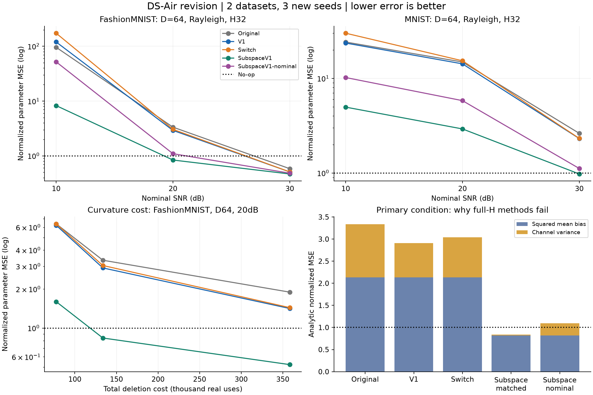

# DS-Air 보완 GPU 실험 — 2026-09-28

**두 보완안을 구현하고 검증했다. 블록별 선택(Switch)은 추가 제어비 때문에 채택 기준을 통과하지 못했다. 고정 부분공간(SubspaceV1)은 일부 조건에서 곡률 비용과 오차를 줄였지만, 데이터셋·fading 전반의 삭제 성공이나 프라이버시를 보장하지 못했다.** 기존 결과를 덮어쓰거나 실패한 설정을 제외하지 않았다.

- [알고리즘·수식·선행연구·한계](METHOD_KO.md)
- [실행 전 고정한 프로토콜](PROTOCOL_KO.md)
- [464개 조건/방법의 전체 결과표](RESULT_TABLES_KO.md)
- [GPU 구현](run_experiment.py), [집계·검증 코드](summarize.py)
- [수학 검사](results/math_checks.json), [결과 감사](results/verification.json), [환경·실행 기록](results/completion.json), [기계 판독 요약](results/summary.json)

## 보완한 부분

| 항목 | 이번 구현/검증 | 결과 |
|---|---|---|
|전처리가 항상 유리한가|실제 평균전력·peak 제한, scale 변화, 송신 전/후 inverse의 잡음 계수 비교|단일 좌표에서는 이득 상쇄. 비등방 조건에서는 유리/불리한 경우 모두 존재|
|블록마다 좋은 방식을 고르면 개선되는가|Switch: 두 후보 bound 수집, mode 방송, 반복 예산까지 포함|주 조건에서 V1보다 4.43% 악화. 54개 grid 조건에서 5% 개선은 0개|
|곡률 준비비를 줄일 수 있는가|SubspaceV1: 고정 U에서 H와 residual만 OTA 합산|저비용형의 총 삭제비 39.8% 감소. 단, 오차 손실/실패도 존재|
|기존 소규모 unit 채널 결과가 유지되는가|두 데이터셋, D32/64/128, SNR10/20/30, unit/Rayleigh/CSI 오차|V1은 Original보다 47/54 조건에서 개선하지만 미삭제보다 나은 조건은 19/54|
|가까운 Newton 방식과 다른가|local inverse, diagonal inverse, noisy 충분통계 재학습 비교|한 step 이질적 client 삭제에서는 각자의 bias가 큼. 원 논문 전체 성능 비교는 아님|
|개별 gradient가 공개되지 않는가|full transcript의 정상점 복원 공격, 부분공간 비식별성 예|full 방식의 복원 문제 재확인. 부분공간도 projected gradient를 공개하며 DP 보장 없음|

여기서 DS-Air V1은 **잔존 client가 공통 inverse로 보정한 삭제 residual을 공중 합산**하는 방식이다. A의 과거 업데이트를 단순 차감하지 않는다. Subspace는 그 residual 및 곡률을 공통 좌표 U에 투영한다. client 간 직교 신호 배정이 아니다.

## GPU와 실험 범위

- RTX 3080 10GB, PyTorch 2.11.0+cu128 / CUDA 12.8, 단일 CUDA process.
- FashionMNIST/MNIST 각각 private 10,000개와 test 10,000개. 10개 label-2 client 중 client0 전체 삭제.
- 공개 random ReLU encoder 고정, ridge head 입력 D=32/64/128(각각 bias 포함), 출력 10개, lambda=.01.
- 새로운 partition seed 202609281/282/283. 조건마다 channel/H draw 4개, draw마다 correction noise 32개. 정확도/forget JS는 사전에 고정한 첫 noise 2개에서 전체 평가 데이터를 사용.
- 54개 main 조건과 4개 추가 곡률 조건, 8개 방법, 3 seed, 4 H draw로 **5,568행**. 독립 학습을 5,568번 했다는 의미가 아니다.
- 실행 구간 경과 시간 52.66초, CUDA 최대 할당 메모리 479,794,688byte(약 0.447GiB). 작은 고정 feature head이므로 짧다. kernel-only 시간이나 대형 신경망 학습 비용이 아니다.

기존 실험은 bias 포함 D65였다. 이번 D64 결과는 새 seed와 다른 폭·예산·채널 조건의 확장 실험이므로 과거 `.369 → .210`과 숫자를 직접 이어 붙이면 안 된다. Source 학습은 이상적 충분통계 집계로 계산했고 encoder는 private data로 학습하지 않았다.

## 주 조건: 개선과 실패를 함께 비교

실행 전에 고정한 FashionMNIST, D64, 20dB, 정확한 CSI의 Rayleigh, H 반복32회다. 오차는 아래처럼 정의한다.

\[
E=\frac{\mathbb E\|\widehat W-W_R\|_F^2}{\|W_0-W_R\|_F^2}.
\]

**미삭제=1, 정확한 retained ridge=0이며 작을수록 좋다.** 출력분포의 indistinguishability나 certified unlearning 지표가 아니다. ±는 각 seed 안에서 4개의 H draw를 평균한 뒤 계산한 3 seed의 표준편차다.

| 방법 | 정규화 오차 평균 ± seed SD | 총 삭제 통신비 | test 정확도 |
|---|---:|---:|---:|
|Original|3.3407 ± 2.6774|133,740|67.738%|
|V1|2.9135 ± 2.3790|133,712|67.656%|
|Switch|3.0426 ± 2.5649|133,683|67.603%|
|SubspaceV1, 같은 예산|0.8382 ± 0.1850|133,708|69.416%|
|SubspaceV1, 저비용|1.0942 ± 0.5276|80,518|69.315%|
|LocalNewton|30.3333|133,707|31.083%|
|Diagonal|4.0427|133,663|51.958%|
|StatsRetrain, noisy OTA|162.0505|133,727|65.781%|
|Exact retained ridge, 평가 기준|0|실제 통신 경쟁자가 아님|69.290%|

비용은 real channel-use equivalent이며 RF 시간/에너지를 측정한 값이 아니다. 비교군의 SD 및 다른 조건은 전체 결과표에 있다.

- V1은 Original보다 **12.8% 개선**하지만 두 방법 모두 E>1이다. 이를 삭제 성공이라고 보고하지 않는다.
- Switch는 강한 비교군 V1보다 **4.43% 악화**했다. 주 조건의 사전 채택 기준은 실패다.
- 같은 예산의 Subspace는 Original보다 **74.9%**, 미삭제보다 **16.2%** 평균 오차가 낮다. 그러나 seed별 E가 `.6594 / .8261 / 1.0289`여서 모든 seed에서 미삭제보다 좋은 것은 아니다.
- 저비용 Subspace는 총비용을 **39.8% 절감**했지만 E=1.0942다. 상대 비교 기준은 통과해도 미삭제보다 낫지 않으므로 성공한 저비용 삭제로 채택하지 않는다.

## 왜 전처리만으로 해결되지 않았나

주 조건의 해석적 MSE를 H/channel에 조건부인 평균 오차와 correction noise로 나누면 다음과 같다. Monte Carlo 표의 수치와는 표본 오차만큼 다르다.

| 방식 | 평균 오차 항 | correction 잡음 항 | 합 |
|---|---:|---:|---:|
|Original|2.1325|1.2051|3.3376|
|V1|2.1325|0.7774|2.9099|
|Switch|2.1325|0.9052|3.0377|
|Subspace, 같은 예산|0.8175|0.0210|0.8385|

**full-H 방식은 correction noise를 완전히 제거해도 평균 오차 항 2.1325가 남는다.** 잡음 있는 Hessian의 inverse가 이미 잘못된 방향/크기를 만들었기 때문이다. Switch는 이 항을 바꾸지 못한다. Hessian 수집 반복을 늘리면 개선되지만 비용이 커진다.

| FashionMNIST, D64, 20dB Rayleigh | H8 | H32 | H128 |
|---|---:|---:|---:|
|V1 오차|6.2224|2.9135|1.4166|
|V1 총비용|77,552|133,712|358,352|
|Subspace 같은 예산 오차|1.5997|0.8382|0.5223|
|Subspace 같은 예산 총비용|77,566|133,708|358,366|

H128의 더 좋은 결과는 더 큰 예산을 쓴 결과다. 같은 비용의 개선으로 표현하면 안 된다.

## 두 데이터셋에서 유지되는가

D64,20dB,H32의 대표 조건이다.

| 데이터 / 채널 | Original | V1 | Subspace 같은 예산 | Subspace 저비용 |
|---|---:|---:|---:|---:|
|FashionMNIST / unit AWGN|0.3081|0.2720|0.4161|0.4218|
|MNIST / unit AWGN|0.5998|0.5490|0.4764|0.4832|
|FashionMNIST / Rayleigh|3.3407|2.9135|0.8382|1.0942|
|MNIST / Rayleigh|14.8776|14.2273|2.9224|5.8153|

unit 채널에서는 V1이 Original보다 FashionMNIST 11.7%, MNIST 8.5% 개선한다. FashionMNIST unit 조건에서는 오히려 부분공간이 V1보다 나쁘다. MNIST 20dB Rayleigh에서는 부분공간도 미삭제보다 나쁘다. **항상 부분공간이 우월하다는 결론은 아니다.**

54개 main grid 조건의 seed평균을 세면 V1이 Original보다 좋은 조건 47개, Switch가 두 endpoint 중 강한 방식보다 좋은 조건 2개(5% 이상 개선 0개), 같은 예산의 Subspace가 Original보다 좋은 조건 43개다. 미삭제보다 좋은 조건은 V1 19개, 저비용 Subspace 26개다. 이는 독립 표본에 대한 유의성 검정이나 성공 확률 추정이 아니다.

cutoff 없는 Rayleigh inversion은 deep fade에서 매우 큰 잡음 증폭을 갖는다. 표준편차가 크고 이론적으로 inverse-channel power의 기댓값도 발산한다. 따라서 현재 결과는 유한한 channel 표본에 대한 stress test다. CSI 오차 조건은 별도 channel draw를 사용하므로 정확한 CSI 조건과의 차이를 CSI만의 효과로 분리하지 못했다.

## 비용과 정보 공개의 실제 변화

주 조건에서 full-H 수집은 CP 포함 74,880 real uses, 기저 방송은 44,293으로, 둘만으로 Original 총비용의 약 **89.1%**다. Subspace는 이 둘을 각각 42,336과 24,915로 줄인다.

| 방법 | cached source 후 삭제 | cold source 후 삭제 | source 준비 + 삭제 | 보정 반복 합 |
|---|---:|---:|---:|---:|
|Original|133,740|140,661|144,247|64|
|V1|133,712|140,633|144,219|56|
|Switch|133,683|140,604|144,190|47|
|Subspace, 같은 예산|133,708|140,629|144,215|639|
|Subspace, 저비용|80,518|87,439|91,025|48|

같은 예산 Subspace의 이득에는 절약된 준비비를 639회 반복에 재투자한 효과가 포함된다. 동시에 비용도 절감했다고 주장하지 않는다. 반복이 많아도 같은 세션의 채널이 고정된다는 가정도 남는다.

프라이버시에서는 full transcript로 A의 gradient를 복원하는 수학적 문제가 여전하다. Subspace는 D64,r48에서 선형적으로 관측하지 않는 좌표 160개(16 x 출력10)를 남기지만, U 안의 gradient는 노출된다. 30dB unit 조건의 공격 결과는 다음과 같다.

| 데이터 / 방식 | full-gradient 복원 상대 MSE | projected-gradient 복원 상대 MSE |
|---|---:|---:|
|FashionMNIST / V1|0.00684|0.00684|
|FashionMNIST / Subspace 같은 예산|0.23455|0.00053|
|MNIST / V1|0.00776|0.00776|
|MNIST / Subspace 같은 예산|0.19804|0.00054|

작을수록 이 공격이 잘 복원한다는 의미다. 부분공간의 full 복원오차가 커졌다는 사실은 DP가 아니다. **전체 관측에 대한 프라이버시는 미해결**로 기록했다.

## 논문으로 주장할 수 있는 범위

지금 결과로는 새로운 강한 언러닝 알고리즘이 완성되었다고 하기 어렵다. Switch는 보류하고, V1은 unit 채널의 조건부 이득을 유지한다. Subspace는 비용-근사오차 절충안으로 남기되 MNIST fading 실패와 정보 노출을 숨기면 안 된다.

현재 가장 구체적인 연구 결과는 전력/peak/준비비까지 포함한 오류 분해, adaptive 선택의 제어비 역전, 그리고 곡률 통신이 병목이라는 진단이다. 국내 학회용으로도 OTA Newton 선행연구와 비교하여 삭제 목적의 차별성을 더 입증해야 한다. 다음 보완은 retained client 누락 없이 deep fade를 처리하고 대기·재전송 비용까지 비교하는 한 가지 문제로 좁히는 편이 타당하다. 이번에는 그 후속 실험을 진행하지 않았다.

## 재현과 검증

GPU 재실행에는 CUDA 지원 PyTorch, NumPy 및 압축 해제된 IDX 데이터가 필요하다. 선택적 그림에는 Matplotlib이 필요하다. dataset, checkpoint, 개별 gradient는 업로드하지 않았다. 결과 JSON의 통계/공개 관측 지표만 보존했다.

```bash
python research_20260928_ds_revision/download_mnist.py --out /path/to/MNIST/raw
python research_20260928_ds_revision/run_experiment.py --stage math
python research_20260928_ds_revision/run_experiment.py --stage run --fashion /path/to/FashionMNIST/raw --mnist /path/to/MNIST/raw
python research_20260928_ds_revision/summarize.py --plots
```

CUDA 실행 환경은 `CUBLAS_WORKSPACE_CONFIG=:4096:8`, TF32 off였다. 다른 GPU/라이브러리의 bitwise 재현까지 보장하지 않는다. 위 GPU 명령은 results를 다시 쓰므로 재실행은 별도 복사본에서 수행한다. 프로토콜과 실행 코드의 SHA256을 math/run 기록에 저장한다. `summarize.py`는 GPU 없이 표준 라이브러리만으로 기존 5,568행의 예산·전력·비용 합계·동일 평균·오차 분해·코드 hash를 감사한다(`--plots` 제외). Raw dataset SHA256은 completion 기록에 있다.

검사 결과: quadratic 삭제 항등식 최대오차 2.1e-17, full-gradient 복원 항등식 최대오차 3.1e-15, physical MAC 합산 최대오차 1.1e-16, 실제 반복평균 분산 차이 1.24% 이내. 모든 기록의 전력/예산 한도와 원장 합계 검사를 통과했다. **이는 구현 검증이며 언러닝 성공 인증이 아니다.**



그림은 조건별 평균이다. 전체 seed SD와 개별 결과는 위 표/JSON에 공개했다. [벡터 PDF](comparison.pdf)도 제공한다.
