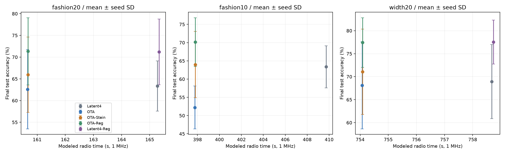

# 폭·채널 AirComp-SFL: 선행 대조, 수학 검산, GPU 실험

2026-09-28. **구조는 성립하고 학습도 된다. 다만 ‘폭을 나눠 공중에서 합산’ 자체는 선행과 겹치며, 이번 보정 후보를 새 논문 기여로 채택할 근거는 부족하다.** 기본 OTA보다 나아졌다는 결과와 강한 대조군보다 낫다는 결과를 구분한다.

RTX 3080에서 Fashion-MNIST 학습 **81회**를 순차 실행했다. 각 비교 조건은 seed311/312/313, 80round이며, 무선 채널을 시뮬레이션했다. 실제 RF 장비 측정은 아니다. 예비 seed301/302는 아래 평균에서 제외했다. 이번 작업은 별도 SFL 검증이며 기존 SegOTA 후보의 CNN 검증으로 간주하지 않는다.

- [전체 수치·비용 구성·채널 stress](RESULT_TABLES_KO.md)
- [설명: submodel을 공중에서 합산하는 것은 가능하다](SUBMODEL_SUM_KO.md)
- [알고리즘·수식·실험 조건](PROTOCOL_KO.md)
- [선행 논문의 해결책과 겹침](LITERATURE_KO.md)
- [기계 판독 결과](summary.json), [파일 hash](manifest.json), [예비 실험 구분](PILOT_NOTE.md)

## 1. 어디까지 이미 연구됐나

|선행|해결 방식|이번에 새 기여로 주장하지 않는 부분|
|---|---|---|
|[FedDCT, TNSM 2023](https://arxiv.org/html/2211.10948v2)|큰 CNN의 폭을 작은 submodel로 나눠 cluster가 공동 학습. 원본 대신 main client의 중간 feature를 proxy에 전달|폭 분할로 장치 계산/메모리를 줄이는 아이디어|
|[OTA split ML, JSAC 2023](https://arxiv.org/html/2210.04742v2)|MIMO precoder–channel–combiner가 NN 선형층을 구현. Reciprocity backward와 convolution 확장|채널 연산을 공중에서 처리하는 구조|
|[Analog split inference, 2021](https://arxiv.org/abs/2106.00999)|장치 측 선형 변환 후 feature의 공중 가중합|Projection + AirComp|
|[SL-ACC, 2025](https://arxiv.org/html/2508.12984v1)|Feature channel 중요도를 바탕으로 그룹별 압축|중요 채널에 다른 전송량을 주는 압축|

FedDCT의 raw-data 문제 해결도 중요하다. 각 장치의 독립 이미지를 그대로 합산하지 않는다. Main client가 앞부분 모델을 실행하고 추상 feature를 보내며 개별 gradient를 회수한다. 이 절차의 모든 신호가 곧바로 OTA 합산 가능한 것은 아니다. 본 실험의 common latent 구조는 별도로 설계한 제한된 모델이다.

## 2. 구현한 폭·채널 구조

각 장치의 feature h_k와 로컬 projection A_k, 서버 공통 B에 대해

$$u_k=A_kh_k,\qquad s=B\sum_k u_k+b.$$

채널 폭이 달라도 공통 q차원 u_k를 보내면 합산할 수 있다. 서버는 d=Bᵀ(∂ℓ/∂s)를 공통 broadcast하고, 장치 k는 A_kᵀd로 역전파한다. 이 identity는 **W_k=BA_k로 정의한 모델**에 대한 식이다. q를 줄여 임의의 full model과 정확히 같아지는 것이 아니다.

두 가지 입력 구조를 구분했다.

1. **Multi-view cohort:** 같은 이미지의 네 quadrant를 네 sensor가 각각 처리. Cohort 네 개 사이에 실제 FedAvg를 수행한다. 동일/이기종 CNN 폭을 평가했다.
2. **Same-input channel branches:** 같은 28×28 입력에 대한 서로 다른 CNN 채널을 네 장치가 처리. Branch 내부 grouped convolution과 합산층을 쓴다. 입력을 각 장치에 전달하는 비용도 포함했다. 이 설정은 원본 공유가 허용된 조건이며 private horizontal SFL의 해결책으로 주장하지 않는다.

일반 horizontal SFL에서 A와 B가 서로 다른 이미지의 activation을 보내면 해당 loss는 합산으로 보존되지 않는다. GPU float64 검산에서 합산/연결 표현의 forward 오차는 6.22e-15, backward 오차는 7.11e-15였다. 독립 샘플을 잘못 더한 counterexample도 확인했다. [검산 원장](math_validation.json)

## 3. 새로 좁혀 시험한 후보: OTA-Stein

송신 평균 전력을 맞추는 공통 scale alpha가 activation 크기에 의존한다. 따라서 scale로 복원한 수신 잡음 분산 v(u)도 activation에 의존한다. 이 의존성을 무시한 backward는 기대 무선 손실의 전체 gradient와 다를 수 있다.

**OTA-Stein**은 서버가 aggregate에서 suffix의 Hessian trace를 HVP 한 번으로 추정하고, trace 스칼라와 bottleneck 장치 ID를 보낸다. 해당 장치만 자신의 latent에 비례한 누락 항을 더한다. 새 Hessian 이론이나 Newton 방법이 아니며 기존 Gaussian 미분 항등식의 분산 구현 후보다. Exact CSI·smooth suffix·continuous backward 등의 수학 조건은 [프로토콜](PROTOCOL_KO.md)에 있다.

100,000 Gaussian draw의 이차 손실 검산에서 gradient 상대오차는 기본 31.023%, 실제 noise를 아는 oracle pathwise 0.171%, scalar trace 방식 0.167%, **1-probe trace 방식 0.168%**였다. 실제 complex OTA 코드의 real 잡음 분산도 이론 1.640755, 경험값 1.640534로 일치했다. 이는 작은 기대 gradient 검증이며 CNN 정확도 보장은 아니다. [원장](noise_gradient_validation.json)

단순 대조군 **OTA-Reg**는 trace를 1로 고정한 channel-scaled L2 보정이다. 디지털 대조군 **Latent4/8-Reg**에도 같은 항을 적용하여 일반 regularization 효과를 확인했다.

## 4. 실제 분류·통신 결과

아래는 최종 모델 test 정확도의 **학습 시드3 평균 ± SD**. 같은 시드의 채널 draw3개를 먼저 평균했다. 시간은 forward/backward/control/pilot/초기 배포/model sync를 포함한 **총 학습 무선 점유시간**이며 1MHz 모델값이다. Validation/test는 offline 채널 평가이며 이 통신 장부에 포함하지 않는다.

### Multi-view, 동일 폭8, q16, train/test 20dB

|방법|정확도 %|총 학습 통신 s|
|---|---:|---:|
|Digital 4-bit|63.36 ± 5.79|165.272|
|기본 OTA|62.60 ± 9.11|160.662|
|OTA-Stein|65.94 ± 8.67|160.677|
|OTA-Reg, 단순 보정|71.34 ± 7.73|160.677|
|Digital 4-bit + 같은 보정|71.21 ± 7.58|165.330|
|Digital 8-bit + 같은 보정|72.07 ± 7.72|170.902|

- OTA-Stein은 기본 OTA보다 **+3.34%p**, 하지만 단순 OTA-Reg보다 **−5.40%p**이며 세 시드 모두 낮았다.
- 단순 보정은 digital에서도 63.36→71.21%로 개선됐다. OTA-Reg 71.34%만 보고 AirComp 고유의 정확도 개선이라고 주장할 수 없다.
- 기본 OTA의 forward UL 점유시간은 digital4 대비 **83.6% 감소**했지만 **총비용은 2.79% 감소**했다. OTA의 model sync가 총비용의 **96.83%**를 차지했다.
- Trace 보정 추가 통신량은 총비용의 약0.009%이지만, GPU 보정 구간은 2.87s로 고정 보정0.63s보다 무거웠다. 전체 GPU 학습+validation 평균도 13.23s vs11.08s였다. 이것은 한 GPU의 시뮬레이터 측정이다.

### Multi-view, train/test 10dB

|방법|정확도 %|총 학습 통신 s|
|---|---:|---:|
|Digital 4-bit|63.36 ± 5.79|409.731|
|기본 OTA|52.22 ± 5.86|397.762|
|OTA-Stein|63.96 ± 9.09|397.806|
|OTA-Reg|70.13 ± 6.70|397.806|

잡음이 커지면 누락 항을 보정하는 효과는 더 분명했다(+11.74%p). 그래도 단순 보정보다 6.16%p 낮았다. Digital은 채널에 맞게 속도를 낮추는 이상적 error-free coding을 가정하므로 정확도가20dB와 같고 통신시간이 늘어난다. Digital-Reg의10dB 추가 학습은 실행하지 않았다.

### 같은 입력의 실제 channel 분할, train/test 20dB

|방법|정확도 %|총 학습 통신 s|
|---|---:|---:|
|Digital 4-bit|68.93 ± 8.05|758.678|
|기본 OTA|68.10 ± 9.46|754.068|
|OTA-Stein|71.07 ± 9.30|754.083|
|OTA-Reg|77.42 ± 5.40|754.083|
|Digital 4-bit + 같은 보정|77.52 ± 4.77|758.736|

채널 분할에서도 학습은 된다. 하지만 기본 OTA의 전체 통신 절감은 **0.61%**였다. Model sync76.92%, raw input 배포22.40%가 대부분이다. 단순 보정의 효과 역시 digital에서 재현됐다. 입력이 이미 각 장치에 있으면 배포비는 없어지지만 model sync 병목은 남는다. 이 비용 비율은 현재 local5step/FedAvg 주기와 전송률 가정에 따른 것이며 모든 SFL의 보편적 수치는 아니다.



## 5. 폭 축소와 이기종 지원은 무엇을 보여줬나

Multi-view 기본 OTA에서 폭8→4로 줄이면 장치 forward MAC/sample이 **83,104→27,440(67.0% 감소)**, 총 통신160.66→79.63s(50.4% 감소), 정확도62.60→60.70%(−1.90%p)였다. 이것은 모델 용량/폭을 줄인 효과가 포함된 비교다. Digital4도 폭 축소로 통신165.27→84.24s를 줄인다. 따라서 이 절감 전체를 AirComp 기여라고 쓰지 않는다.

같은 입력 channel 분할에서는 폭8→4의 MAC이332,416→109,760, 통신754.07→460.80s, 정확도68.10→64.79%였다. 같은 전체 branch 모델을 한 장치에서 실행할 때에 비해 역할을 나눌 수는 있지만, 원본 CNN과 같은 용량/정확도를 유지하면서 4배 빨라졌다고 입증한 것은 아니다.

HET=[4,8,12,4]에서도 q16 공통 인터페이스로 학습됐다. 기본 OTA58.25%, Stein64.48%, Reg68.89%; 비용은 약140.7s였다. Width12 장치의 MAC은166,992로 오히려 크므로 모든 client의 부하가 동시에 줄었다고 해석하지 않는다. 자동 width 배정/최적화 알고리즘을 제시한 실험도 아니다.

## 6. 논문으로 진행할지

**이번 OTA-Stein 후보는 주력 논문안으로 채택하지 않는다.** 수학적 누락 항과 기본 방식 대비 개선은 확인했지만, 단순 정규화가 더 좋고 그 효과는 digital에서도 나타났다. 가장 가까운 선행의 공식 adaptive 압축/beamforming 알고리즘을 이겼다는 근거도 없다. 국내 학회라도 현재 자료만으로 새 우수 알고리즘이라고 주장하기는 어렵다.

살릴 수 있는 내용은 (1) 어떤 channel 분할이 OTA 합산과 정확히 맞는지, (2) 전력 정규화의 signal-dependent noise가 만드는 gradient 항, (3) payload 절감과 총비용 절감이 크게 다른 이유를 정리한 **검증/진단 자료**다. 단순 폭 분할·저차원 투영·정규화에 새 이름만 붙여 신규성으로 삼지 않는다.

또한 지금 큰 병목은 activation payload가 아니라 client-side projection까지 반복해서 동기화하는 비용이다. 이를 줄이려면 학습 주기, model sync 통신 또는 구조 자체를 바꿔야 한다. 그러나 동기화 주기를 늘리는 것만은 기존 local-update 원리이므로 바로 새로운 해결책으로 주장하지 않는다. 이번 결과로 SFL/AirComp 전체가 불가능하다고 결론내리지도 않는다.

**남은 검증 범위:** Fashion-MNIST 하나와 작은 smooth CNN, 학습 시드3, 단일 GPU simulation이다. CIFAR/실측 RF/최적 hyperparameter 비교/기존 전체 알고리즘 재현/DP 보장은 없다. CSI는 기본 실험에서 이상적으로 정확하다고 가정했고 pilot8symbols를 세었다고 실제 완전 CSI가 보장되는 것은 아니다. 평균 전력 제약만 검산했으며 peak/PAPR, circuit/CPU energy는 제외했다.

## 재현

필요 패키지: CUDA PyTorch, numpy, matplotlib. Fashion-MNIST raw IDX4개 파일은 저장소에 포함하지 않는다. 시드와 원본 hash는 결과 JSON의 dataset 필드에 있다.

PowerShell에서 새 output directory로 81회 학습과 결과 감사를 실행한다:

```powershell
./reproduce.ps1 -Python 'C:/path/to/python.exe' -FashionRaw 'C:/path/to/FashionMNIST/raw' -OutputRoot './replication'
```

외부 dependency 경로를 쓰는 환경은 `-DependencyPath`를 지정한다. 파일명만 보고 완료 run을 건너뛰므로 설정/코드가 달라졌다면 반드시 다른 빈 OutputRoot를 사용한다. 기본 결과를 다시 분석하려면 `python analyze.py`. 수학 검산은 `python run_sfl.py --verify`, `python verify_noise_gradient.py`이며 기본 수학 JSON을 재생성한다.

`manifest.json`의 `code/`와 `source/` prefix는 각각 이 폴더의 코드와 수학 원장을 가리키는 논리 이름이다. Raw run은 실제 상대 경로다. Prototype code hash가 다른 smoke/pilot은 확인 실험과 합치지 않는다. 새 Python 코드는 자체 구현이며 논문 저자의 공식 결과로 표기하지 않는다.
