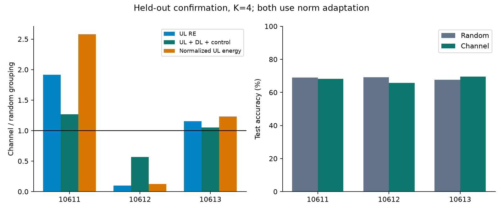

# SISA-AirComp: 실험 설계·구현·1차 결과 및 개선

2026-10-03. 설계만 제시한 상태가 아니라 실행·검증·보고까지 완료했다. 본 실험25조건과 preflight1조건, 후속 codec replay9조건을 단일 GPU worker로 순차 수행했다. 기존 연구 결과는 보존했다.

**현재 판단:** 독립 SISA 부분 재학습을 기준 구조로 유지한다. 채널이 비슷한 client끼리 묶는 방법은 개선의 일관성이 부족하여 기본 배정으로 채택하지 않는다. 현재 norm을 이용한 AirComp scale과 무손실 downlink 차분 전송을 구현했고, 후자는 추가 탐색에서 정확한 모델을 유지하며 전송량을 줄였다. 새 알고리즘의 문헌 최초성을 확인한 결과는 아니다.

## 실행 조건

- FashionMNIST train12000/dev2000/test10000, 20 clients, Dirichlet alpha .5, 약38k-parameter CNN. 공개 backbone 없음.
- K=1/2/4/5, raw-image 모델을 새로120 rounds 학습, local SGD2x64, client-balanced update 평균. 전원 최초 라운드부터 참여. client0 전체 삭제.
- 고정 shard 안에서 AirComp 합만 모델 업데이트에 사용; shard 모델 간 학습 상태 공유 없음. 최종 확률 앙상블. client 전체 삭제에서는 최초 checkpoint부터 재학습하므로 중간 slice 저장의 추가 절감은 없다.
- 이상적 직교 shard 전송, 완전 CSI, 장기 gain -20~0dB + bounded fading, 집계 noise squared norm1e-4 이하. 같은 목표에 필요한 반복 전송을 실제 ledger에 포함.
- source 모델, A-free 전체 shard 재학습, 해당 shard replay를 각각 실행했다. 시뮬레이터 random tape coupling 아래 reference와 bitwise 일치를 검증했다.
- 현재 norm scalar32bits와 CSI/ID가 서버에 노출된다. 개별 gradient/history를 서버 저장하는 프로토콜은 아니다. 최소4명 집계는 이번 K4 단일 삭제 조건이며 프라이버시 인증이 아니다.

## 원래 가설: 채널에 따른 shard 배정

Screening seed10601의 dev 기준으로 K4를 선택한 뒤, 새 seed10611/10612/10613에서 random_norm 대 channel_norm을 비교했다. 두 방법 모두 동일한 norm 정보와 gain 제어를 사용한다.

| 항목 | 새 seed3개 결과 | 판단 |
|---|---:|---|
| UL RE | 평균 자원량 20.95% 감소 | UL-only 효과 |
| UL+DL+control 전체 RE | 7.89% 감소 | 사전 목표10% 미달 |
| 전체 RE가 개선된 seed | 1/3 | 사전 목표2/3 미달 |
| test 정확도 차이 | 평균 -0.65pp | seed별 편차 큼 |
| 언러닝 reference 일치 | 본 실험25/25 | 구현 검증 통과 |

채널 grouping은 약한 client가 모인 shard에 삭제 요청이 들어오면 비용이 커질 수 있다. 실제 seed10611은 전체 RE가27.00% 증가했고, 정규화 UL 에너지는약2.58배였다. 평균만 보고 이 방법을 채택하지 않았다. 채널-데이터 상관 스트레스1조건은 별도 보고했으며 주 확인 결과에 합치지 않았다.

## 관측 후 개선: 무손실 downlink 차분 codec

추가안을 별도 사전등록한 뒤 기존 confirmation9조건의 삭제 replay를 다시 수행했다. 원래 grouping 가설의 성공으로 합산하지 않는다. client는 직전 수신 global model 하나의 FP32 bytes를 보관한다. 서버가 현재 모델의 bit pattern을 이전 buffer와 XOR하고 zlib level6로 압축한다. 더 짧은 full-model 압축/raw 방식으로 fallback한다. float 빼기나 양자화가 아니므로 디코딩 모델은 원본과 모든 비트가 같다.

비교군에도 full-model zlib 압축과 raw fallback을 적용했다. 모든 방식에 동일한128-bit packet header를 포함했다. 최초 checkpoint 전송 때 buffer를 reset하므로 삭제 전 모델에 의존하는 초기 동기화를 가정하지 않았다.

| K4 random_norm, seed3개 | 결과 |
|---|---:|
| full-model 압축 대비 DL bytes | 15.56% 감소 |
| full-model 압축 대비 전체 RE | 9.41% 감소 |
| 원래 raw FP32 DL 대비 전체 RE | 13.58% 감소 |
| test 정확도 | 68.55% (기존 모델과 동일) |
| 추가 client cache | 149.54KiB/client |
| full-model 압축 평균 encode / decode | 4.729 / 0.630ms/model |
| XOR 방식 평균 encode / decode | 14.825 / 0.819ms/model |
| 실제 packet encode/decode 검증 | 1080/1080 bitwise 일치 |
| 기존 재학습 모델과 최종 일치 | codec9/9 |

이 결과는 byte/RE 절감이다. CPU 압축 비용이 추가되므로 실제 종단간 지연까지 줄었다고 말하지 않는다. 기존 lossless coding을 이 경로에 적용한 구현 개선이며 AirComp 고유의 신규성을 주장하지 않는다. 초기 학습 codec, packet loss, cache miss, 모바일 CPU를 측정하지 않았다.

| Seed | 방식 | DL 절감/full % | 전체 절감/full % | 전체 절감/raw % |
|---:|---|---:|---:|---:|
| 10611 | K1 random_norm | 16.82 | 15.52 | 21.31 |
| 10611 | K4 random_norm | 15.59 | 10.73 | 15.37 |
| 10611 | K4 channel_norm | 15.56 | 8.33 | 12.08 |
| 10612 | K1 random_norm | 16.35 | 14.02 | 19.50 |
| 10612 | K4 random_norm | 15.47 | 7.74 | 11.27 |
| 10612 | K4 channel_norm | 15.69 | 14.29 | 20.08 |
| 10613 | K1 random_norm | 17.18 | 15.38 | 21.01 |
| 10613 | K4 random_norm | 15.61 | 10.37 | 14.87 |
| 10613 | K4 channel_norm | 15.72 | 9.93 | 14.24 |

## 재학습보다 무엇이 줄었는가

- K4의 삭제 shard에는4명의 retained clients만 참여한다. K1 전체 재학습19명 대비 local 계산은78.95% 줄었다. 같은 라운드·minibatch 횟수에서의 계산량 비교다.
- 같은 codec을 K1에도 적용한 공정한 비교에서 K4 random_norm의 평균 삭제 전체 RE는 K1의1.568배였다. 따라서 SISA가 단일 모델 AirComp 전체 재학습보다 무선 자원까지 자동으로 줄인다고 주장하지 않는다.
- 원래 raw-DL ledger에서 K4 random_norm 초기 통신은 K1의6.031배였다. initial cost를 숨기지 않는다. 초기 비용 포함 lifecycle projection은 원래 상세 보고서에 있으며 실제 누적 삭제 실험이 아니다.
- fixed FDMA에서 elastic 할당으로 바꾸면 빈 대역폭을 회수하지만, full-band TDMA와 이상적 elastic FDMA의 유효 RE는 같다. 동시 전송의 이득을 별도로 과장하지 않는다.
- 새 codec은 UL 파형과 local gradient를 바꾸지 않는다. UL 송신 energy 절감은 추가로 주장하지 않는다. DL transmitter energy 및 회로전력은 미측정이다.

## 다음 실험의 구체적 설계

아래는 이번에 실행하지 않은 후속 설계다. 현재 결론을 바꾸기 위한 무제한 추가 실행은 하지 않았다.

1. **삭제 분포:** 고정 client0만 삭제한 한계를 보완해 균등한 client 삭제와 약한 채널 client에 집중된 삭제를 분리한다. client별 비용의 평균 및90/95백분위를 평가하고 여러 shard 동시 삭제를 포함한다.
2. **배정 개선:** 채널 유사도만으로 묶는 방식 대신, 예상 삭제 비용의 평균과 최악값을 함께 제한하는 고정 배정을 비교한다. 데이터 분포 요약을 사용한다면 그 제공 비용·노출과 삭제 범위를 명시한다. 현재 개별 update history를 요구하는 방식은 도입하지 않는다.
3. **무선 현실성:** source/replay에 CSI 오차, 주파수 선택성, client dropout을 추가한다. 원하는 집계MSE를 못 맞추는 outage와 재전송을 포함하고, shard 간 잔여 간섭이 삭제 영향 범위를 넓히는지 평가한다.
4. **codec 현실성:** 동일 모델 경로에서 packet loss/cache reset 비율을 바꾸고 full refresh 비용을 합산한다. 실제 payload rate와 client CPU를 측정해 압축으로 절약한 통신 시간과 codec 비용을 함께 판단한다.
5. **일반화:** 독립 seed 확대, CIFAR-10, iid/non-iid 및 학습량을 늘린 조건으로 정확도-비용 frontier를 확인한다. 현재120round의 정확도를 모델의 상한으로 해석하지 않는다.

## 총비용과 검증 범위

preflight+본실험+codec 추가실험 측정 wall time **592.17s (9.87min)**, GPU board energy **25.1015Wh**, local update calls **149832**, 외부 유료 서비스 사용 **0**. GPU worker는 한 번에 하나. 5초 간격 board power 적분이며2초 preflight 소비량은 표본 부족으로 잡히지 않았다. host 전체 전력, 전기요금, CPU-only audit/report 시간은 미포함.

CPU 독립 검증은 본 실험25조건의 저장된 모델/예측/ledger를 확인했고 추가 codec1080개 packet의 기록 합계와 새 자원 원장을 독립 재계산했다. 실제RF 장비, 프라이버시 공격 평가, DP/암호학적 보장, 문헌 최초성, 누적 삭제는 검증하지 않았다.

## 파일

- [실행 전 설계](../PREREGISTRATION.md), [추가 codec 사전등록](../AMENDMENT_DL_CODEC.md)
- [원래 실험 상세 보고서](../summary_v1/REPORT_KO.md), [전체 지표 CSV](../summary_v1/all_metrics.csv)
- [codec 지표 CSV](codec_metrics.csv), [종합 결정·총비용](decisions_and_cost.json)
- 원자료: ../run_v1/ 각 조건의 model/probabilities/partition/labels/ledger; ../codec_v1/ 실제 packet 길이·CPU 시간·검증 원장.
- [실행 코드](../experiment.py), [codec 코드](../codec.py), [독립 검증 코드](../analyze.py).
